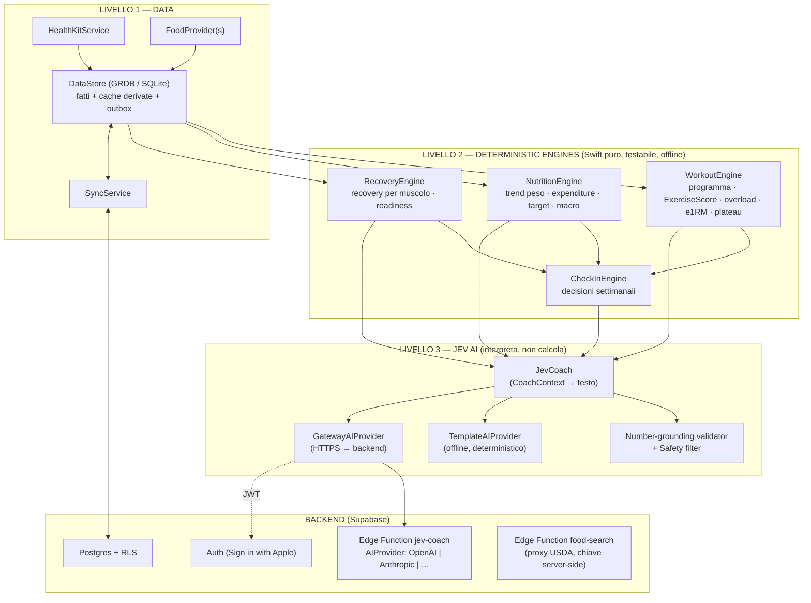

# JEV FIT — Piano architetturale per revisione (Fase 0 → 2)

Autore: Agent 00 (Lead Architect / CTO) · Data: 2026-10-05 · Stato: **in attesa di approvazione utente**
Documenti collegati: `REQUIREMENTS_AUDIT.md`, `PRODUCT_SPEC.md`, `USER_FLOWS.md`, `SCREEN_MAP.md`, `../DECISIONS.md`, `../PROJECT_STATE.md`

Questo documento risponde ai 10 punti richiesti prima di scrivere codice:
1 architettura · 2 struttura cartelle · 3 schema database · 4 schermate · 5 algoritmi · 6 agenti · 7 roadmap · 8 rischi · 9 MVP · 10 V2.

---

## 1. Architettura proposta

### 1.1 Vista a livelli



### 1.2 Principi architetturali

**Engine puri.** I quattro engine sono funzioni pure su value type `Sendable` (input → output), senza I/O, senza `Date()` interno (il tempo entra come parametro), senza dipendenze Apple oltre Foundation. Conseguenze: Swift 6 strict concurrency gratis, determinismo, test rapidi, coverage misurabile con `swift test`, riusabilità futura (backend, widget, watch).

**Fatti vs derivati.** Il database distingue i *fatti* (ciò che l'utente o HealthKit hanno registrato: set, pesate, alimenti loggati, decisioni accettate) dai *derivati* (trend, expenditure, recovery, readiness, PR). I derivati sono cache locali ricalcolabili in qualsiasi momento dagli engine e **non si sincronizzano**: così non possono esistere conflitti di sync su numeri calcolati, e un bug corretto in un engine si ripara ricalcolando.

**InsightsPipeline.** Un `actor` che osserva i cambiamenti dei fatti (GRDB `ValueObservation`), con debounce ~300 ms ricalcola solo gli engine coinvolti e scrive le cache derivate. La UI legge le cache (startup istantanea: all'avvio si mostra l'ultimo stato calcolato, il ricalcolo avviene in background). Volume dati realistico: anni di dati giornalieri = migliaia di righe; tutti gli algoritmi sono O(n), ricalcolo completo < 50 ms stimati.

**Offline first.** Ogni scrittura va prima su SQLite locale (ogni set del workout è persistito al tap) e in una **outbox**. La sync è un processo separato, idempotente, che può fallire e riprovare senza effetti sull'uso.

**AI come livello di presentazione.** JEV riceve un `CoachContext` (JSON strutturato prodotto dagli engine: fatti numerici con ID, decisioni, reason code, confidence). Il testo generato passa da un validatore che verifica che **ogni numero** presente nel testo corrisponda a un fatto del contesto; se no → retry, poi fallback al template deterministico. Decisione e numeri mostrati in UI sono renderizzati dagli oggetti dell'engine, non dal testo AI.

### 1.3 Stack tecnico

| Area | Scelta | Perché (ADR) |
|---|---|---|
| UI | SwiftUI, Observation (`@Observable`), Swift Charts | Nativo iOS 18, nessuna dipendenza |
| Pattern | Feature-based + MVVM leggero (ViewModel `@MainActor @Observable` solo dove c'è logica di schermata) | Brief; niente TCA/VIPER (overengineering) |
| Concurrency | Swift 6 language mode, strict concurrency complete | Brief |
| Persistenza locale | **GRDB 7** (SQLite) con migrazioni SQL esplicite | ADR-004: record `Sendable` struct, migrazioni deterministiche speculari al backend, ottimo con Swift 6; SwiftData ha attriti noti con strict concurrency e migrazioni |
| Backend | **Supabase**: Postgres + RLS, Auth (Sign in with Apple), Edge Functions (Deno/TS) | Citato nel brief (RLS); un solo fornitore per DB, auth, gateway AI |
| Client backend | `supabase-swift` (auth + PostgREST) | Gestione token/refresh |
| DI | Composition root `AppContainer` creato all'avvio; servizi esposti come protocolli via `EnvironmentValues`; engine senza DI (funzioni pure) | Semplice, testabile, niente framework DI |
| Navigazione | `TabView` (5 tab) + `NavigationStack` per tab con `enum Route: Hashable`; `AppRouter` `@Observable` per sheet/fullScreenCover/deep link `jevfit://` | Tipizzata, deep link testabili |
| Progetto Xcode | **XcodeGen** (`project.yml`) + package locale `JevKit` | Niente `.pbxproj` scritto a mano, generabile in CI |
| Test | Swift Testing (`import Testing`) per engine e repository; XCUITest smoke per i flussi DoD | Standard Xcode 16+ |
| CI | GitHub Actions: job macOS (xcodebuild build + test su simulatore iOS 18) + job `swift test` engine con coverage gate 90% | Unico modo di garantire "compila" senza un Mac nel loop |
| Logging | `os.Logger` con `privacy: .private` di default; nessun valore sanitario nei log | Agent 12 |
| Lingue | String Catalog (`.xcstrings`) IT primario, EN secondario | Utente italiano, prodotto commerciale futuro |

Dipendenze esterne totali dell'app: **GRDB**, **supabase-swift**. Nient'altro nell'MVP.

### 1.4 Concurrency model (Swift 6)

`DataStore` incapsula un `DatabasePool` GRDB (thread-safe, `Sendable`); i repository sono `struct Sendable`. ViewModel e Router sono `@MainActor`. `InsightsPipeline`, `SyncService`, `HealthKitService` sono `actor`. Gli engine sono `nonisolated` e operano solo su value type. Nessun `@unchecked Sendable` salvo wrapper documentati attorno a tipi Apple non annotati (es. `HKHealthStore`), ciascuno con un commento che spiega la garanzia.

### 1.5 Backend e sicurezza (sintesi, dettaglio in Fase 2 `SECURITY.md`)

Ogni tabella ha `user_id uuid not null references auth.users` e policy RLS `user_id = auth.uid()` per select/insert/update/delete. Il client usa solo la publishable key (non segreta per design) + JWT dell'utente; nessuna service-role key nel client. Le chiavi OpenAI/Anthropic/USDA vivono come secret delle Edge Functions. Il gateway `jev-coach`: verifica JWT, rate limit per utente, rimuove identificativi personali dal contesto, sceglie il modello per tier (`routine` / `analysis`) da variabili d'ambiente, impone output JSON con schema, registra solo metadati (latenza, token, modello, esito validazione), mai il contenuto. SQLite locale protetto da Data Protection (`completeUntilFirstUserAuthentication`, necessario per notifiche/background); token in Keychain. I dati HealthKit "fisiologici" (HRV, RHR, sonno, FC) **restano sul dispositivo** e non vengono caricati sul cloud: sono già disponibili su ogni dispositivo dell'utente via Salute.

**GDPR (utente in Italia) e regole Apple.** Peso, misure, allenamenti, alimentazione, limitazioni/dolore sono dati relativi alla salute (art. 9 GDPR). Quindi: consensi espliciti e separati per (a) sync cloud e (b) JEV AI online, revocabili in Impostazioni → Privacy; progetto Supabase in **regione UE**; accordi di trattamento (DPA) con Supabase e con il provider AI, con opzione di zero data retention lato provider dove disponibile; export ed eliminazione completa dei dati. Le App Review Guidelines Apple (sezione 5.1.3) limitano l'uso e la condivisione dei dati HealthKit con terzi: Agent 12 deve verificare il testo aggiornato prima di inviare a un provider AI qualsiasi dato derivato da HealthKit; fino ad allora nel `CoachContext` entrano solo sottopunteggi, mai valori HealthKit.

---

## 2. Struttura cartelle

```
jev-fit/
├── README.md                      # setup, build, test
├── PROJECT_STATE.md               # memoria condivisa del team (aggiornata a ogni milestone)
├── DECISIONS.md                   # ADR semplificati
├── project.yml                    # XcodeGen → JevFit.xcodeproj (generato, non versionato)
├── App/                           # target applicazione (sottile)
│   ├── JevFitApp.swift            # @main, scene, lifecycle
│   ├── AppContainer.swift         # composition root / DI
│   ├── Info.plist · JevFit.entitlements · PrivacyInfo.xcprivacy
│   └── Resources/                 # Assets.xcassets, Localizable.xcstrings
├── Packages/JevKit/
│   ├── Package.swift
│   ├── Sources/
│   │   ├── JevCore/               # PURO: unità (Mass, Energy), DayKey, ID (UUIDv7), Clock, statistica robusta, Kalman 1D/2D
│   │   ├── JevDomain/             # PURO: tipi di dominio condivisi (Exercise, MuscleGroup, WorkoutSet, FoodNutrients, Goal…)
│   │   ├── ExerciseCatalog/       # PURO: catalogo esercizi originale (JSON in Resources) + loader + validazione
│   │   ├── WorkoutEngine/         # PURO
│   │   ├── NutritionEngine/       # PURO
│   │   ├── RecoveryEngine/        # PURO (recovery muscolare + readiness)
│   │   ├── CheckInEngine/         # PURO (dipende dai tre engine)
│   │   ├── CoachKit/              # PURO: AIProvider, CoachContext, template, grounding validator, safety rules
│   │   ├── Persistence/           # GRDB: schema, migrazioni, record, repository, DataStore, outbox, InsightsPipeline
│   │   ├── Sync/                  # SyncService (Supabase), mapping record ↔ DTO
│   │   ├── Health/                # HealthDataSource protocol, HealthKitService, PreviewHealthDataSource
│   │   ├── Food/                  # FoodProvider protocol, LocalFoodProvider, OpenFoodFactsProvider, GatewayFoodProvider
│   │   ├── DesignSystem/          # token (colori, tipografia, spaziature), componenti (MetricRing, MacroBar, RecoveryChip, ConfidenceBadge, WDCPanel, BigStepper, RIRPicker, TrendSparkline, BodyMap…)
│   │   └── Features/              # Onboarding, Today, Train, WorkoutLive, Nutrition, FoodLogger, Body, Progress, Jev, CheckIn, Settings, Account
│   └── Tests/                     # un target di test per ciascun modulo
├── AppTests/ · AppUITests/        # smoke test integrazione + XCUITest dei flussi DoD
├── backend/supabase/
│   ├── config.toml
│   ├── migrations/                # SQL versionato (schema cloud + RLS)
│   ├── functions/jev-coach/       # gateway AI: router, providers/openai.ts, providers/anthropic.ts, schema, guard
│   ├── functions/food-search/     # proxy USDA FoodData Central
│   └── tests/                     # test RLS (pgTAP) e unit test TS
├── tools/catalog/                 # script di generazione/validazione catalogo esercizi e alimenti base
├── docs/                          # PRODUCT_SPEC, USER_FLOWS, SCREEN_MAP, DATA_MODEL, ALGORITHMS, SECURITY, SIGNING, QA_DEVICE_CHECKLIST…
└── .github/workflows/ci.yml
```

Regola di dipendenza tra moduli (verificata dal `Package.swift`, i cicli non compilano):
`JevCore ← JevDomain ← {ExerciseCatalog, WorkoutEngine, NutritionEngine, RecoveryEngine} ← CheckInEngine ← CoachKit ← Persistence ← {Sync, Health, Food} ← Features ← App`. `DesignSystem` dipende solo da `JevCore`/`JevDomain`.

---

## 3. Schema database (sintesi — dettaglio completo in `docs/DATA_MODEL.md`, Fase 3)

### 3.1 Colonne comuni dei "fatti" sincronizzati
`id UUID (v7, generato dal client)` · `user_id` · `created_at` · `updated_at` (client) · `server_updated_at` (assegnato da trigger, usato come cursore di pull) · `deleted_at` (tombstone) · `origin_device_id`. Localmente in più: `sync_state` (`synced | pending | conflict`).

### 3.2 Tabelle

Legenda: **F** = fatto sincronizzato · **L** = fatto solo locale · **D** = derivato (cache locale, ricalcolabile, mai sincronizzato) · **S** = statico/catalogo incluso nell'app

| Dominio | Tabella | Tipo | Campi chiave |
|---|---|---|---|
| Profilo | `user_profile` | F | birth_year, height_cm, sex (nullable), experience, activity_level, unit_system, energy_unit, pregnancy_or_lactation (bool, nullable: se vero nessun deficit) |
| | `goal` | F | type (strength/hypertrophy/maintenance/recomp/fat_loss/general), target_weight_kg, target_rate_pct_week, started_at, ended_at |
| | `app_settings` | F | macro_mode (auto/assisted/manual), check-in weekday, calorie cycling, notifiche, preferenze display |
| | `training_preferences` | F | days_per_week, preferred_weekdays, session_minutes, split_preference, equipment[], muscle_priority[] |
| | `exercise_preference` | F | exercise_id, kind (favorite/excluded/disliked) |
| | `limitation` | F | body_area, severity, note, active (dato sensibile: mai nei log, mai inviato all'AI con testo libero) |
| Corpo | `weight_entry` | F | measured_at, day_key, tz, weight_kg, source (manual/healthkit), hk_uuid (unique) |
| | `body_measurement` | F | type (body_fat_pct, waist…), value, measured_at, source, hk_uuid |
| | `health_metric_daily` | L | day_key, steps, active_kcal, sleep_minutes, resting_hr, hrv_sdnn_ms, source_coverage |
| | `weight_trend_daily` | D | day_key, trend_kg, slope_kg_week, sd |
| Allenamento | `muscle_group` | S | id (17 gruppi), region, size_class, base_tau_h |
| | `exercise` | S+F | catalogo statico + custom utente (F): name_key, category, movement_pattern, equipment[], difficulty, laterality, mechanics, fatigue_score, stimulus_score, stability_req, rom_profile, load_increment_kg, **load_type** (external/bodyweight/assisted/timed), **bodyweight_fraction**, contraindicated_areas[] |
| | `exercise_muscle` | S+F | exercise_id, muscle_id, role (primary/secondary), contribution |
| | `exercise_alternative` | S | exercise_id, alternative_id, similarity |
| | `training_program` | F | split, mesocycle_index, week_index, started_at, rep/RIR scheme, status |
| | `workout_template` | F | program_id, sequence_index, name, focus muscles |
| | `workout_template_exercise` | F | template_id, exercise_id, order, sets, rep_range, target_rir, rest_s, superset_group (V2) |
| | `workout_session` | F | template_id (nullable), started_at, ended_at, status (in_progress/completed/abandoned), day_key, tz, notes, source |
| | `workout_exercise` | F | session_id, exercise_id, order, replaced_from_exercise_id, superset_group |
| | `workout_set` | F | workout_exercise_id, index, set_type (warmup/working/top/backoff/drop/failure/amrap), weight_kg, **entered_value + entered_unit** (valore originale kg/lb, evita falsi PR da conversione), added_load_kg (zavorra/assistenza), reps, rir (nullable), rpe, duration_s, rest_s, completed_at, target_weight_kg, target_reps, pain_level (none/mild/strong) |
| | `pain_report` | F | day_key, body_area, level, exercise_id, acknowledged_at (sblocca gli aumenti di carico) |
| | `performance_record` | D | session × exercise: best_e1rm, volume_kg, hard_sets, top_set |
| | `exercise_trend` | D | exercise_id, day_key, e1rm_stable, sd, plateau_flag |
| | `personal_record` | D | exercise_id, kind (e1rm/reps_at_weight/volume), value, achieved_at, set_id |
| | `muscle_recovery` | D | muscle_id, as_of, recovery_pct, fatigue_state, eta_ready_at |
| | `recovery_calibration` | F | muscle_id, user_tau_multiplier, n_observations (appreso → sopravvive a reinstallazione) |
| | `readiness_entry` | D | day_key, score, components JSON, confidence |
| | `subjective_check` | F | day_key, sleep_quality, energy, soreness (1–5) — input essenziale per chi non ha Apple Watch |
| Nutrizione | `food` | S+F | catalogo base (S), custom (F), cache remoti (L): source, source_id, barcode, name, brand, nutrients per 100 g (kcal, protein, carbs, fat, fiber, sugar, sat_fat, sodium), verified |
| | `food_serving` | S+F | food_id, label, grams |
| | `recipe` / `recipe_ingredient` | F | yield_grams, servings; ingredient food_id, grams |
| | `meal` | F | pasto salvato riutilizzabile (gruppo di alimenti) |
| | `food_log_entry` | F | day_key, tz, meal_slot (breakfast/lunch/dinner/snack), food_id/recipe_id (nullable per quick add), grams/servings, **snapshot nutrienti** al momento del log, logged_at |
| | `nutrition_day` | F | day_key, status (open/complete/incomplete), day_type (training/rest) |
| | `daily_nutrition` | D | day_key, totals, adherence |
| | `energy_expenditure` | D | day_key, tdee, sd, confidence, prior_weight |
| | `nutrition_target` | F | effective_from, mode, kcal_training, kcal_rest, weekly_avg, origin (onboarding/check-in/manual), check_in_id |
| | `macro_target` | F | nutrition_target_id, day_type, protein_g, carbs_g, fat_g, fiber_g |
| JEV | `weekly_check_in` | F | week_start, metrics JSON (snapshot), decisions JSON, user_response per decisione, engine_version |
| | `ai_recommendation` | F | kind, payload (fatti + reason code), text, provider, model, confidence, status, created_at |
| | `ai_conversation` / `ai_message` | L (sync opzionale V2) | role, content, context_refs |
| Sistema | `outbox` | L | table, record_id, op, attempts, last_error |
| | `sync_cursor` | L | table, last_server_updated_at |
| | `schema_meta` | L | engine_version (per invalidare i derivati quando cambia un algoritmo) |

Le entità richieste dal brief sono tutte presenti; ho aggiunto `training_program`, `workout_template_exercise`, `exercise_alternative`, `training_preferences`, `exercise_preference`, `limitation`, `nutrition_day`, `recovery_calibration`, `outbox`, `sync_cursor` perché senza di esse i flussi non funzionano.

### 3.3 Migration strategy
Locale: `DatabaseMigrator` GRDB con migrazioni nominate e immutabili (`v001_initial`, `v002_…`), mai modificate dopo il rilascio; test che applica tutte le migrazioni su un DB vuoto e su un fixture della versione precedente. Cloud: file SQL in `backend/supabase/migrations/` con lo stesso numero di versione logica. Derivati: al cambio di `engine_version` le cache derivate vengono svuotate e ricalcolate (nessuna migrazione di dati calcolati). Sync tra versioni diverse dell'app: campi nuovi sempre nullable o con default; il client ignora campi sconosciuti.

### 3.4 Sync senza duplicati
ID generati dal client (UUIDv7) → push = `upsert on conflict (id)`: inviare due volte lo stesso record è innocuo. Pull per tabella con `server_updated_at > cursor`, paginato. Conflitti: last-writer-wins per record su `updated_at`, protetto da un trigger server che **limita `updated_at` a `now() + 5 min`** (un iPhone con l'orologio avanti non vince per sempre); il **tombstone vince** su una modifica concorrente. Eccezioni: `workout_set` e `food_log_entry` non vengono mai cancellati da un merge (solo tombstone esplicito). Deduplica naturale: vincoli unique su `hk_uuid` (pesate da Salute), su `(user_id, barcode)` per alimenti remoti in cache, su `(user_id, week_start)` per i check-in. Test dedicati: doppio push, push interrotto a metà, due dispositivi offline che modificano lo stesso record, orologio del dispositivo sbagliato.

---

## 4. Elenco schermate

Dettaglio completo, stati e wireframe in `docs/SCREEN_MAP.md` (Agent 01). Struttura:

| Area | Schermate principali | MVP |
|---|---|---|
| Onboarding (SCR-ONB-01…17) | Benvenuto, obiettivo, esperienza, dati corpo, sesso (opzionale, spiegato), attività, peso target + ritmo, giorni/tempo, attrezzatura, split, preferiti/esclusi, limitazioni, priorità muscolari, modalità macro, unità, HealthKit, notifiche, riepilogo piano | ✔ |
| Oggi (SCR-HOME) | Context card (riprendi workout / safety / check-in / pesata), JEV READINESS con JEV TODAY, Workout Today, calorie rimanenti + P/C/F, trend peso, recovery muscolare, goal progress | ✔ |
| Allenamento (SCR-WK) | Programma e prossima sessione, anteprima sessione, **Workout Live** (full screen), swap esercizio, set editor, summary post-workout, storico, dettaglio esercizio (e1RM, PR, trend), libreria esercizi, crea/modifica template, impostazioni programma | ✔ |
| Nutrizione (SCR-NU) | Home nutrizione (calorie consumate/target, macro, pasti, expenditure, trend peso, obiettivo settimanale), logger (search/recenti/preferiti/barcode/quick add), dettaglio alimento + porzioni, crea alimento custom, ricette, pasti salvati, copia giorno/pasto, target & modalità macro, storico | ✔ |
| Corpo (SCR-BODY) | Body map fronte/retro con recovery, dettaglio muscolo, pesate e misure, readiness detail | ✔ |
| Progressi (SCR-PR) | 14 grafici con filtri 7g/30g/3m/6m/1a/tutto, dettaglio grafico | ✔ |
| JEV (SCR-JEV) | JEV sheet: consiglio del giorno, raccomandazioni WDC, chat contestuale, storico | ✔ |
| Check-in (SCR-CI) | Panoramica → decisioni → conferma, storico | ✔ |
| Impostazioni (SCR-SET) | Profilo, obiettivo, nutrizione, allenamento, attrezzatura, limitazioni, unità, Salute, notifiche, privacy & dati (export, elimina), account & sync, informazioni/licenze | ✔ |
| V2 (SCR-V2-*) | Widget, Live Activity, foto progressi, abbonamento, Watch | — |

---

## 5. Algoritmi principali

Tutti nei target puri, ognuno con: specifica in `docs/ALGORITHMS.md`, parametri in una struct `Config` versionata (nessun numero magico sparso), test unitari + test di proprietà + test di simulazione. I valori numerici qui sotto sono **default iniziali** da validare con Agent 11 e con i tuoi dati reali.

### 5.1 Trend del peso — filtro di Kalman robusto livello + pendenza
Stato `x = [livello kg, pendenza kg/giorno]`, transizione `F = [[1, Δt],[0, 1]]` con Δt in giorni (gestisce giorni mancanti), rumore di processo da accelerazione bianca (q piccolo: il trend vero cambia lentamente), rumore di misura σ² stimato dall'utente (MAD dei residui, prior 0,6 kg). **Robustezza**: se l'innovazione supera 2,5σ la misura viene pesata secondo Huber (σ inflazionata); con q tarato ≤ 1e-5 una pesata anomala (+1,8 kg) sposta il trend di < 0,2 kg (verificato da Agent 11: 87–290 g per q tra 1e-6 e 1e-4, quindi q va tarato e testato). σ proporzionale al peso; **una sola osservazione per `day_key`** (Δt ≥ 1); aggiornamento della covarianza in forma di Joseph (stabilità numerica); ordinamento stabile per id a parità di timestamp. Valore del giorno = prima pesata (default) o media del giorno (opzione), altre pesate conservate. Output: trend oggi, pendenza kg/settimana ± SD, variazione 7 e 21 giorni (differenza del livello lisciato con smoother RTS all'indietro, usato per i grafici). Test: serie costante, rampa, gradino, outlier isolati, buchi di 10 giorni, una sola pesata, valori negativi/zero/impossibili (rifiutati in input).

### 5.2 Expenditure (TDEE) adattiva — modello stato-spazio congiunto
Invece di "media intake − Δpeso" su finestre sovrapposte (che conta due volte gli stessi dati), un unico filtro con stato `[massa tessuto M, expenditure E]`:
- `M(t+1) = M(t) + (Intake(t) − E(t)) / ρ + w` (ρ = densità energetica della variazione di peso, default 7.700 kcal/kg, configurabile)
- `E(t+1) = E(t) + v` (random walk lento: l'expenditure reale cambia con attività e adattamento)
- misura: peso bilancia = `M + rumore` (acqua, glicogeno, contenuto intestinale)
- giorni con intake non loggato o marcato "incompleto": l'intake è trattato come ignoto → incertezza aumentata su quel passo invece di inventare un valore.
- **plausibilità dell'intake**: un giorno > 6.000 kcal o > 2,5 × E stimata richiede conferma all'utente; se non confermato il giorno è trattato come incompleto (un errore di battitura da 40.000 kcal non deve corrompere trend ed expenditure).
- ρ = 7.700 kcal/kg introduce una distorsione sistematica nota (≈ 150 kcal se la densità reale è ~5.500, tipico in soggetti magri); il ciclo di controllo dei target converge comunque. Documentato in UI ("stima") e in `ALGORITHMS.md`.

**Prior**: `E0 = BMR × fattore attività` con BMR Mifflin-St Jeor (Katch-McArdle se c'è % grasso affidabile; senza sesso costante intermedia −78 kcal), deviazione standard prior 15% di E0 (18% senza sesso). Il prior **perde importanza automaticamente**: è solo la condizione iniziale del filtro, man mano che arrivano dati la varianza a posteriori è dominata dalle osservazioni. Prime 2 settimane dopo un cambio di intake > 300 kcal: rumore di misura aumentato (acqua/glicogeno).
**Confidence** = `clamp(1 − σ_post / σ_ref, 0, 0,99)` con **riferimento assoluto fisso σ_ref = 400 kcal** (non relativo al prior: altrimenti chi non indica il sesso, avendo un prior più largo, otterrebbe una confidence più alta a parità di dati), moltiplicata per la completezza del logging degli ultimi 21 giorni. Etichette (allineate a PRODUCT_SPEC): < 50% "Stima iniziale", 50–79% "In calibrazione", ≥ 80% "Affidabile".
**Validazione obbligatoria — Monte Carlo** (≥ 500 seed): utente sintetico con TDEE vero 2.600 kcal, intake rumoroso, peso con rumore ±0,7 kg, prior sbagliato di ±500 kcal. Criteri: con logging completo mediana |errore| ≤ 120 kcal e 90° percentile ≤ 250 kcal a 28 giorni, 90° percentile ≤ 150 kcal a 56 giorni; con 20% di giorni non loggati soglie +25%; confidence media crescente nel tempo. (Agent 11 ha mostrato che un test "entro ±120 kcal a 28 giorni" su un singolo seed fallirebbe ~1 volta su 3 per pura statistica: la sola pendenza su 28 giorni con rumore 0,7 kg ha errore standard ~126 kcal.)

### 5.3 Target calorico e aggiustamento settimanale
`target_giornaliero_medio = E_post + rate_target_kg_sett × ρ / 7`.
Vincoli: ritmo di perdita tra 0,25% e 1,0% del peso/settimana, di aumento tra 0,1% e 0,5%; floor assoluto `max(BMR stimato, 1.200 kcal)`; variazione automatica per check-in limitata a ±150 kcal (dead band ±50 kcal: sotto non si cambia nulla), ±250 kcal se l'utente modifica manualmente. **Calorie cycling**: con media settimanale A, t giorni di allenamento e rapporto r = kcal_training / kcal_rest scelto dall'utente: `rest = 7A / (t·r + 7 − t)`, `training = r · rest`, arrotondati a 10 kcal, l'ultimo giorno assorbe l'errore di arrotondamento perché la somma settimanale sia esatta. Il rapporto è limitato prima del calcolo: `r_eff = min(r_utente, ((7A / floor) − 7 + t) / t, r tale che nessun giorno superi ±15% dalla media)` (senza questo vincolo A = 1.500, t = 6, r = 1,30 darebbe un giorno di riposo a 1.193 kcal, sotto il floor).
**Gate di sicurezza sull'obiettivo**: gravidanza/allattamento dichiarati → nessun deficit; BMI attuale < 18,5 → obiettivo dimagrimento non selezionabile; età < 18 → nessun obiettivo in deficit (l'onboarding non procede sotto i 16 anni). Se a metà settimana un giorno cambia tipo, i giorni rimanenti vengono ribilanciati senza scendere sotto il floor.

### 5.4 Macro
Peso di riferimento = trend weight; se BMI > 30 e % grasso ignota si usa il peso corrispondente a BMI 27 (evita target proteici gonfiati). Proteine (g/kg): forza/ipertrofia/mantenimento 1,8 · ricomposizione 2,0 · dimagrimento 2,2 · fitness generale 1,6 (range coerenti con ISSN 2017 e Morton 2018). Grassi: 30% kcal con minimo 0,6 g/kg. Carboidrati: residuo. Fibra: 14 g / 1.000 kcal. Se il residuo carboidrati è negativo (target molto basso): grassi al minimo, poi proteine fino a 1,6 g/kg, poi stato "infeasible" segnalato (mai valori negativi). **AUTO**: tutto l'engine. **ASSISTED**: l'utente sposta la ripartizione carboidrati/grassi, proteine bloccate sopra il minimo, il solver mantiene `4P + 4C + 9F = kcal` (±1%). **MANUAL**: libero, kcal derivate dai macro, avvisi non bloccanti sotto i minimi.

### 5.5 Generazione programma
Split da giorni disponibili (se lo split preferito è compatibile ha la precedenza): 2 → Full Body ×2 · 3 → Full Body ×3 · 4 → Upper/Lower ×2 (o Torso/Limbs) · 5 → Hybrid (U/L + P/P/L) · 6 → PPL ×2. Volume settimanale per muscolo (serie "hard", conteggio frazionario: primario 1, secondario 0,5) per esperienza in ipertrofia: principiante 8–10, intermedio 10–16, avanzato 14–20; forza: compound principali a volume moderato, accessori ridotti; mantenimento ≈ 1/3–1/2 del volume di costruzione; priorità muscolare +30% entro il massimo. Distribuzione: ogni muscolo ≥ 2 volte/settimana se i giorni lo consentono, massimo ~10 serie hard per muscolo per sessione. Budget tempo: `Σ serie × (durata serie + recupero) + riscaldamento`, recuperi per obiettivo (forza compound 150–240 s, ipertrofia 90–150 s, isolamento 60–90 s). **Mesociclo** 4–6 "settimane di programma", dove una settimana di programma = **un giro completo della rotazione** (il programma non è legato al calendario): RIR target 3 → 2 → 2 → 1, poi deload. La rampa di volume (+1 serie/muscolo per settimana di programma) è *proposta* dal mesociclo ma ha **un solo responsabile**: il CheckInEngine, che la applica (INCREASE TRAINING LOAD), la sospende (KEEP) o la inverte (REDUCE) — mai due incrementi sommati. Se il volume richiesto supera il tempo disponibile, si taglia in quest'ordine: accessori dei muscoli non prioritari → serie oltre il minimo efficace → mai i compound principali. Gli esercizi principali sono **ancorati** per tutto il mesociclo (altrimenti non si può misurare il progresso); la varietà interviene ai confini del mesociclo e sugli accessori.

### 5.6 ExerciseScore — versione matematicamente sensata
Il prodotto di 8 fattori del brief ha tre difetti: un fattore a 0 annulla tutto, i fattori non sono sulla stessa scala, i pesi relativi sono impliciti. Proposta in due stadi.

**Stadio 1 — vincoli duri (filtro, non punteggio):** attrezzatura disponibile, esercizio escluso, limitazione dichiarata **grave** o dolore "forte" sull'area dell'esercizio (`contraindicated_areas`), difficoltà ≤ esperienza + 1. Le limitazioni lievi non escludono: penalizzano tramite il fattore dolore (allineato a PS-ON-08). Un esercizio che non passa non entra mai, indipendentemente dagli altri fattori.

**Stadio 2 — punteggio di qualità** come media geometrica pesata, limitata in `[ε, 1]`:
`S(e) = exp( Σᵢ wᵢ · ln max(fᵢ(e), ε) )`, con `Σ wᵢ = 1`, `ε = 0,05`.
Fattori `fᵢ ∈ (0, 1]`: compatibilità di recupero (sigmoide sul recovery pesato dei muscoli coinvolti, centro 55%), compatibilità con l'obiettivo (tabella obiettivo × meccanica × rapporto stimolo/fatica), preferenza (preferito 1,0 · neutro 0,75 · non gradito 0,35), priorità muscolare, varietà (solo ai confini del mesociclo), performance (in progresso 1,0 · ignoto 0,8 · plateau 0,6 · regressione 0,5), penalità di fatica `1 − 0,6 · fatigue_norm · (1 − readiness/100)`, **fattore dolore** `pain_f = 1 − 0,6 · exp(−giorni_dall'ultima_segnalazione / 14)` per esercizi dell'area segnalata (lieve) o con limitazione lieve. Proprietà testabili: monotonia in ciascun fattore, limiti, nessun annullamento, pesi interpretabili ("il recupero conta il 25%").

**Selezione della sessione** — greedy con utilità marginale sui bisogni di volume:
`U(e | scelti) = S(e) · Σₘ need_m · c_{e,m} − κ · fatigue_e`, dove `need_m` è il volume ancora da coprire per il muscolo m in questa sessione e si aggiorna dopo ogni scelta. Si sceglie finché c'è budget di tempo e utilità positiva. Tie-break deterministico per ID; la casualità della varietà usa un seed `(userId, mesocycleIndex)` → stessi input, stesso workout (riproducibile e testabile).

### 5.7 Progressive overload
Per ogni esercizio: rep range `[lo, hi]`, RIR target, incremento di carico `Δ` (per attrezzatura: bilanciere 2,5 kg, manubri al prossimo disponibile, macchine passo del pacco pesi; personalizzabile; in lb incrementi propri e valore originale salvato in `entered_value/entered_unit`).

**Carico effettivo per tipo** (`load_type`): external → peso inserito; bodyweight → `trend_weight × bodyweight_fraction + zavorra`; assisted → `trend_weight × fraction − assistenza`; timed (plank, isometrici) → progressione sulla **durata**, nessun e1RM.

**Tabella delle regole** sulle serie working dell'ultima esposizione — completa e mutuamente esclusiva, valutata in ordine, default "mantieni" (test di proprietà: ogni input cade in esattamente una regola):

| # | Condizione | Azione |
|---|---|---|
| 0 | Dolore segnalato sull'area negli ultimi 14 giorni non ancora "letto" dall'utente, oppure sessione di deload/ridotta | **Mantieni** (aumenti di carico bloccati) |
| 1 | RIR mancante su tutte le serie | Solo progressione reps: tutte ≥ hi → carico + Δ; altrimenti reps target + 1 |
| 2 | Tutte le serie ≥ hi reps **e** RIR ≥ target | **Aumento carico** + Δ (o +2,5% arrotondato a Δ se maggiore), reps = lo; se inoltre la prima serie ha RIR ≥ target + 2 → + 2Δ |
| 3 | Reps < lo **o** RIR < target − 1 su ≥ 2 serie, per la 2ª esposizione consecutiva | **Regressione** −5/−10% arrotondata a Δ, **minimo un passo Δ** (evita che −5% di 10 kg con Δ = 2 arrotondi a 0) |
| 4 | Reps < lo **o** RIR < target − 1 su ≥ 2 serie (prima volta) | **Mantieni** carico e reps |
| 5 | Reps medie in `[lo, hi)` e RIR medio ≥ target − 1 | **Aumento reps** (+1, carico invariato) = *double progression* |
| 6 | Altrimenti (es. un solo set sotto lo) | **Mantieni** |

**Aggiustamento live**: se la prima serie working devia dal RIR target di ≥ 2, le serie successive cambiano di ±2,5–5% (arrotondato a Δ).

**e1RM** (solo load_type ≠ timed, serie con reps ≥ 1 e RIR noto ≤ 3): ripetizioni a cedimento stimate `r' = reps + RIR`. r' = 1 → e1RM = carico. 2 ≤ r' ≤ 10 → media di Epley `w·(1 + r'/30)` e Brzycki `w·36/(37 − r')`; 10 < r' ≤ 12 → solo Epley; r' > 12 → nessun e1RM mostrato. Serie con RIR ≥ 4 o "5+" escluse dalla stima (RIR lontano dal cedimento poco affidabile). Serie da 0 reps: contano come dose per il recupero, escluse dall'e1RM. **e1RM stabile** = filtro robusto livello+pendenza del §5.1 applicato in **scala logaritmica** (rumore relativo, parametri propri, non quelli del peso) alle sessioni non di deload → valore ± SD.

**Indice di forza per il trend e il plateau**: per r' fino a 20 si usa un indice relativo (Epley normalizzato sulla prima esposizione del mesociclo), così anche gli esercizi a 12–20 reps hanno trend e plateau detection.

**Plateau**: ≥ 6 esposizioni in ≥ 21 giorni (sessioni di deload e ridotte escluse) **e** limite superiore dell'intervallo di confidenza all'80% della pendenza ≤ +0,25%/settimana **e** nessun PR di reps. (Agent 11: con 4 esposizioni e rumore 3% un utente che progredisce dell'1%/settimana verrebbe segnalato in plateau nel 29% dei casi.) Azioni suggerite in ordine: cambiare rep range, variante (alternatives), deload se associato a readiness bassa.

**Deload**: unica definizione, decisa dal CheckInEngine (§5.10): a fine mesociclo, oppure anticipato se ≥ 50% degli esercizi principali in plateau/regressione **e** readiness media 7 giorni < 40 → serie −40/−50%, carichi −10%, RIR ≥ 3 per una settimana di programma.

### 5.8 Recupero muscolare — fatica a decadimento esponenziale con calibrazione personale
Ispirato al modello fitness-fatigue di Banister applicato per gruppo muscolare. Ogni serie genera per il muscolo m una dose
`d = c_{e,m} · I(RIR) · F_e · k_m`
con `c` contributo (1 primario, 0,5 secondario), `I(RIR)` prossimità al cedimento (RIR 0 → 1,0 · 1 → 0,9 · 2 → 0,8 · 3 → 0,65 · ≥ 4 → 0,5; RIR mancante → 0,8; warm-up 0,1), `F_e` fatigue score dell'esercizio (0,7–1,3), `k_m` tolleranza cronica (effetto *repeated bout*: chi fa abitualmente molto volume su quel muscolo accumula meno fatica per serie; `k = clamp((10 / max(volume_settimanale_28g, 5))^0,3, 0,7, 1,25)`).
Fatica accumulata `F_m(t) = Σ d_k · exp(−(t − t_k) / τ_m)`, recupero `R_m = 100 · exp(−F_m / F_ref)`.
**Calibrazione di F_ref**: definito in modo che una sessione dura da 6 serie a RIR 1 (dose 6 × 0,9 = 5,4) porti il recupero al 35% subito dopo → `F_ref = 5,4 / ln(1/0,35) ≈ 5,14`. Con τ = 30 h torna al 90% in ~69 h (verificato da Agent 11), coerente con le 48–72 h riportate in letteratura per gruppi grandi. Non è un timer lineare: dipende da serie, intensità, esercizio, frequenza e storico.
`τ_m = τ_base_m · a(età) · u_m`: τ_base ~24 h muscoli piccoli (deltoidi laterali, polpacci, avambracci), ~30 h medi (incl. bicipiti, per i quali la letteratura sul danno eccentrico suggerisce prudenza), ~38 h grandi/alto danno (quadricipiti, femorali, glutei, lombari); `a = 1 + 0,005 · max(0, età − 30)` (evidenze miste: è una scelta prudenziale documentata, non un dato); `u_m ∈ [0,7; 1,5]` **moltiplicatore personale appreso**.
**Adattamento**: alla successiva esposizione del muscolo si confronta la performance osservata con quella attesa **al netto del trend e1RM** (altrimenti chi progredisce sembrerebbe recuperare più in fretta) dato il recupero stimato; residui sistematicamente negativi con recupero "alto" → `u_m` aumenta (recupero più lento), positivi con recupero "basso" → diminuisce. Passi piccoli (η = 0,05), limitati, attivi solo dopo ≥ 6 esposizioni.
**Tempo a "pronto"** (soglia unica 90%, allineata a PRODUCT_SPEC): se `R_m ≥ 90` → 0; altrimenti `t = τ · ln(F_m / (F_ref · ln(100/90)))`. Guard espliciti: F_m = 0 o non finito → 0 (mai `ln(0)` né conversioni a intero di valori infiniti).

### 5.9 JEV READINESS (0–100)
Sottopunteggi 0–100 rispetto alle **baseline personali** (28 giorni, minimo di dati richiesto prima di usare un componente):

| Componente | Peso | Fonte | Senza Watch |
|---|---|---|---|
| Recupero dei muscoli della sessione di oggi | 0,22 | RecoveryEngine | ✔ |
| Sonno (ultima notte + media 3 notti vs fabbisogno personale) | 0,18 | HealthKit | parziale |
| Check soggettivo (qualità sonno, energia, indolenzimento 1–5) | 0,12 | utente (opzionale) | ✔ |
| HRV: solo campioni notturni, ln(SDNN) — Salute fornisce SDNN, non rMSSD — media 7 g vs baseline, min. 5 campioni, una sola fonte | 0,12 | HealthKit | ✗ |
| FC a riposo (inversa), z-score | 0,08 | HealthKit | ✗ |
| Carico di allenamento: carico = Σ serie hard × I(RIR); rapporto EWMA 7/28 g, **attivo solo con ≥ 21 giorni di storico** (indicatore controverso in letteratura: peso basso e mai condizione unica di una decisione) | 0,08 | storico | ✔ |
| Bilancio energetico vs **pianificato**: penalizza solo un deficit reale oltre quello previsto dal piano di +10 punti % | 0,08 | NutritionEngine | ✔ |
| Performance recente vs attesa | 0,08 | WorkoutEngine | ✔ |
| Giorni consecutivi di allenamento (≥ 4 penalizza) | 0,04 | storico | ✔ |

`Readiness = Σ wᵢ sᵢ / Σ_{disponibili} wᵢ` (pesi rinormalizzati sui soli componenti presenti, somma pesi = 1,00); `confidence = Σ_{disponibili} wᵢ · qualitàᵢ`. Con solo iPhone resta un punteggio valido con confidence più bassa, dichiarata in UI. Fasce (allineate a PRODUCT_SPEC): 85–100 Alto · 65–84 Buono · 40–64 Moderato · 0–39 Basso. Mai inventare un componente mancante.

### 5.10 CheckInEngine — tabella decisionale con priorità e isteresi
Ordine di valutazione (il primo gate che scatta vincola i successivi):
1. **Sufficienza dati** (allineata a PRODUCT_SPEC): < 4 giorni di logging **completi** o < 4 pesate nella settimana → nutrizione NO ACTION con motivazione "dati insufficienti"; le decisioni di allenamento restano.
2. **Safety gate**, calcolato **solo sui giorni completi**: perdita > 1,5%/settimana per 2 settimane, intake medio < 1.000 kcal, BMI trend < 18,5 in deficit, gravidanza/allattamento in deficit → INCREASE CALORIES verso il ritmo target (o mantenimento) + messaggio di sicurezza (consulta un professionista); mai DECREASE in questo stato.
3. **Settimana di deload in corso** → decisioni di allenamento = NO ACTION (volume ridotto per scelta, non per fatica).
4. **Nutrizione**: nuovo target dall'expenditure aggiornata e dal ritmo target; |Δ| < 50 kcal → KEEP; altrimenti INCREASE/DECREASE CALORIES con Δ limitata a ±150. Obiettivo di peso raggiunto (trend entro ±0,5 kg) → proposta di passaggio a mantenimento. CHANGE MACROS se la fase dell'obiettivo cambia o il target proteico ricalcolato differisce di > 10 g.
5. **Allenamento**: DELOAD (condizioni del §5.7); readiness media 7 g < 50 con recupero medio < 60% → REDUCE TRAINING LOAD (−20% serie; il rapporto acuto/cronico è solo un elemento a supporto, non condizione necessaria); readiness ≥ 65, aderenza ≥ 80%, recupero medio ≥ 75%, progressione positiva → INCREASE TRAINING LOAD (applica la rampa del mesociclo: +1 serie sui muscoli prioritari/in ritardo, max +20%); singolo esercizio in plateau o con ≥ 2 segnalazioni di dolore in 14 giorni → CHANGE EXERCISE (alternativa); altrimenti KEEP.
6. KEEP = "valutato, il piano resta"; NO ACTION = "non valutabile ora". Distinzione mostrata in UI.
**Isteresi**: una decisione rifiutata non viene riproposta finché gli input rilevanti non cambiano oltre una soglia. Output: `CheckInResult { metriche, [Decision { tipo, delta numerico, reasonCodes, fattiUsati, confidence }] }` → è ciò che JEV riceve e spiega.

### 5.11 JEV — contratto AI e number grounding
`CoachContext` = fatti `{id, etichetta, valore, unità, testo_formattato}` + decisioni + reason code + confidence + flag di sicurezza. Nessun dato identificativo, nessun testo libero delle limitazioni, **nessun dato fisiologico grezzo** (HRV, FC, sonno arrivano all'AI solo come sottopunteggi 0–100 già calcolati) e solo se l'utente ha dato il consenso esplicito al trattamento AI (§1.5).
**Segnaposto invece di cifre**: l'AI scrive `{{fact:bench_e1rm_delta_3w}}` e il client sostituisce il valore formattato dal fatto; **qualsiasi cifra letterale** nel testo AI (e numeri scritti in lettere, es. "novecento") fa fallire la validazione → un retry con feedback, poi fallback al `TemplateAIProvider`. Così un numero giusto non può essere attribuito al dato sbagliato. Output JSON con schema `{headline, body, why[], dataUsed[factId]}`; la confidence è quella dell'engine, non dell'AI.
**Safety in ingresso e in uscita**: i messaggi dell'utente con segnali di allarme (dolore toracico, svenimenti, infortunio, segnali di disturbi alimentari, intake estremo) attivano risposte template che indirizzano a un medico/professionista, senza diagnosi; l'output dell'AI viene filtrato per contenuti non ammessi (digiuni prolungati, farmaci, integratori con dosaggi, diagnosi) → fallback. Routing: `routine` (JEV TODAY, chat breve) → modello rapido; `analysis` (narrazione del check-in settimanale) → modello reasoning; gli ID modello sono variabili d'ambiente del gateway.

---

## 6. Divisione compiti agenti

Gli agenti sono sub-agenti con un brief scritto da me, vincoli espliciti (file che possono toccare, contratti da rispettare) e output verificabile. Io rivedo, integro e faccio il merge. Il lavoro in parallelo avviene solo su moduli senza dipendenze reciproche.

| Agente | Fasi | Output principali | Dipende da |
|---|---|---|---|
| 00 CTO (io) | tutte | architettura, contratti tra moduli (`JevCore`, `JevDomain`), review, merge, PROJECT_STATE, DECISIONS | — |
| 01 Product & UX | 1, 9 (review) | PRODUCT_SPEC, USER_FLOWS, SCREEN_MAP ✔ consegnati | — |
| 03 Data Architect | 3 | DATA_MODEL.md, migrazioni GRDB, migrazioni SQL Supabase + RLS, repository, outbox | 2 |
| 02 iOS Core | 4, 9 | XcodeGen, AppContainer, router, DesignSystem, componenti, notifiche, haptics, accessibilità | 2, 3 |
| 04 Workout Science | 5 | WorkoutEngine + ExerciseCatalog (~150 esercizi originali) + test | 2 (JevDomain) |
| 06 Nutrition | 6 | NutritionEngine + test di simulazione | 2 |
| 05 Recovery & Readiness | 7 | RecoveryEngine + ReadinessEngine + test | 2, 5 (dose da set) |
| 08 HealthKit | 8 | HealthKitService, permessi minimi, mock, letture/scritture | 3 |
| 07 Food Logger | 9 | FoodProvider, provider locale + OFF + gateway, catalogo base, UI logger | 3, 4 |
| 10 Analytics | 9 | Progress con 14 grafici e filtri | 5, 6, 7 |
| 09 JEV AI | 10 | CoachKit, gateway Supabase, provider OpenAI + Anthropic, validator, safety | 5, 6, 7 |
| 11 QA / Scientific | 2→13 (continuo) | test distruttivi, simulazioni, coverage, checklist dispositivo; **non implementa feature** | ogni milestone |
| 12 Security & Privacy | 2, 12 | SECURITY.md, review RLS/segreti/log, PrivacyInfo.xcprivacy | 2, 10 |
| 13 Release | 2, 11, 13 | CI, schemi, warning zero, SIGNING.md, TestFlight readiness | 2 |

Parallelismo pianificato: dopo la Fase 2-3 → **{04, 06, 08}** in parallelo, poi **05** (usa la dose per serie del modello workout), poi **{02-UI, 07, 10}**, poi **09**. Agent 11 rivede ogni milestone prima del merge.

---

## 7. Roadmap per milestone

| Milestone | Fase | Contenuto | Criterio d'uscita (verificabile) |
|---|---|---|---|
| **M0** | 0–1 | Audit, product spec, questo piano | Approvazione utente ← **siamo qui** |
| **M1** | 2 | Scheletro repo, `Package.swift` con tutti i moduli vuoti, `project.yml`, CI, ADR, SECURITY.md | CI verde: app vuota compila su simulatore iOS 18, `swift test` passa |
| **M2** | 3 | DATA_MODEL.md, migrazioni, repository, outbox, schema Supabase + RLS | Test migrazioni e repository verdi; test RLS (utente A non vede dati di B) |
| **M3** | 4 | Design system, navigazione 5 tab, onboarding UI collegato al DB | Onboarding completo salva profilo/obiettivo; deep link funzionano |
| **M4** | 5 | WorkoutEngine + catalogo + test | Coverage ≥ 90%; generazione programma deterministica per tutti gli split |
| **M5** | 6 | NutritionEngine + test di simulazione | Convergenza TDEE nei limiti del §5.2; coverage ≥ 90% |
| **M6** | 7 | Recovery + Readiness + test | Coverage ≥ 90%; readiness valida con soli dati iPhone |
| **M7** | 8 | HealthKit reale + mock | Checklist su iPhone fisico (tu): permessi concessi/negati/parziali |
| **M8** | 9a | Workout Live + summary + storico + overload integrato | Workout completo salvato offline, sopravvive a kill dell'app, overload propone il carico corretto |
| **M9** | 9b | Food logger + nutrition home + target + trend peso | Log offline, barcode, ricette, copia ieri; calorie/macro corretti |
| **M10** | 9c | Home, Body map, Progress | Tutti i 14 grafici con filtri; body map con recovery reale |
| **M11** | 10 | JEV: CoachKit, gateway, provider, check-in settimanale end-to-end | JEV spiega il piano con numeri validati; offline usa template |
| **M12** | 11–12 | QA distruttivo, security review, sync multi-device | Sync senza duplicati sotto test di fault injection; nessun segreto nel client (scan) |
| **M13** | 13 | Release candidate | Tutti i 20 punti della DoD verificati e documentati in PROJECT_STATE |

---

## 8. Rischi tecnici

| # | Rischio | Prob. | Impatto | Mitigazione |
|---|---|---|---|---|
| R1 | **Nessun Xcode nell'ambiente di sviluppo** (container Linux; toolchain Swift non scaricabile dal proxy) | certo | alto | CI GitHub Actions macOS **oppure** build sul tuo Mac a ogni milestone; mai dichiarare "compila" senza log di build |
| R2 | Container effimero: perdita del lavoro non pushato | medio | alto | Repo Git remoto, push a ogni milestone; nel frattempo zip consegnato a ogni milestone |
| R3 | HealthKit verificabile solo su device fisico | certo | medio | Checklist manuale guidata; mock per tutto il resto |
| R4 | Errori di compilazione Swift 6 scoperti tardi (scrivo codice senza compilatore locale) | alto | medio | Milestone piccole, CI a ogni push, API conservative, niente macro esotiche |
| R5 | Stime fisiologiche errate o instabili (TDEE, recupero) | medio | alto | Test di simulazione, confidence esplicita, limiti di sicurezza, parametri versionati e tarabili sui tuoi dati |
| R6 | AI che inventa numeri o dà consigli non sicuri | medio | alto | Number grounding validator, decisioni solo dagli engine, safety template, fallback deterministico |
| R7 | Qualità/licenza dati alimentari (Open Food Facts incompleto, ODbL) | medio | medio | Più provider, flag "verificato", modifica locale, attribuzione ODbL in Impostazioni → Licenze |
| R8 | Conflitti di sync multi-device | basso (uso personale) | medio | ID client, upsert idempotente, derivati non sincronizzati, test di fault injection |
| R9 | Body map: disegnare una mappa anatomica originale richiede tempo | medio | basso | Stile geometrico a pannelli (decisione UX), path SVG originali convertiti in `Shape` SwiftUI |
| R10 | ID modelli AI richiesti (GPT-5.6 Terra/Sol) diversi da quelli reali dell'API | medio | basso | ID come config del gateway, verifica in Fase 10 |
| R11 | Firma ed entitlement HealthKit / TestFlight | medio | medio | `SIGNING.md`; TestFlight richiede Apple Developer Program a pagamento |
| R12 | Scope molto ampio | alto | alto | Ordine delle milestone per valore; ogni milestone lascia l'app in uno stato usabile |

---

## 9. MVP (= Definition of Done)

Onboarding completo con default intelligenti · generazione programma (tutti gli split) e workout del giorno · Workout Live offline con RIR, timer, swap, set types, ripresa dopo chiusura · summary con volume, PR, muscoli, confronto, recupero stimato · progressive overload completo (double progression, aumento carico/reps, mantenimento, regressione, deload, plateau, e1RM stabile) · recovery per 17 muscoli con calibrazione personale · readiness con o senza Watch · food logger (search locale + Open Food Facts, recenti, preferiti, custom, barcode, pasti salvati, ricette, copia ieri, quick add, porzioni/grammi, storico) · calorie e macro AUTO/ASSISTED/MANUAL, calorie cycling · trend peso robusto · expenditure adattiva con confidence · weekly check-in con le 9 decisioni · HealthKit reale (letture + scritture opzionali workout/peso/nutrizione) · JEV: card JEV TODAY, sheet con WDC, chat contestuale, spiegazione del check-in, provider OpenAI via gateway + provider Anthropic già pronto, fallback offline · Progress con 14 grafici e 6 filtri · notifiche locali · sync Supabase senza duplicati · account Sign in with Apple opzionale · export dati JSON/CSV ed eliminazione account · IT + EN · dark/light, Dynamic Type, VoiceOver sui flussi principali · test engine ≥ 90% coverage.

## 10. V2

Widget (readiness, calorie rimanenti) e Live Activity / Dynamic Island per il workout · app Apple Watch · superset e circuiti in UI (modello dati già pronto) · plate calculator · food logging da foto/testo con AI · `OnDeviceAIProvider` (Apple Foundation Models dove disponibile) · covariata attività (passi/energia attiva) nel modello di expenditure · foto progressi e misure avanzate · App Intents / Siri / Shortcuts · illustrazioni e video originali degli esercizi · sync delle conversazioni JEV · abbonamenti StoreKit 2 e paywall · più lingue · condivisione social · dashboard web.

---

## 11. Esito della review distruttiva (Agent 11) e correzioni applicate

Agent 11 ha letto tutti i documenti e ricalcolato gli esempi con uno script. Confermati corretti: calibrazione recupero (69,0 h), calorie cycling (somma esatta anche con t = 0 e t = 7), Brzycki senza divisioni per zero nel dominio usato, costante −78 kcal, somma pesi readiness, 17 muscoli coerenti. Problemi trovati e come li ho risolti in questo piano:

| ID | Gravità | Problema | Correzione (sezione) |
|---|---|---|---|
| QA-01 | BLOCKER | Esercizi a corpo libero/assistiti/isometrici, set da 0 reps, RIR mancante non gestiti; tabella overload incompleta | `load_type`, `bodyweight_fraction`, tabella regole completa ed esclusiva con default "mantieni" (§3, §5.7) |
| QA-02 | BLOCKER | Il dolore non arrivava all'overload né all'ExerciseScore | `pain_report`, fattore `pain_f`, blocco aumenti finché non letto, trigger safety nell'engine (§3, §5.6, §5.7) |
| QA-03 | MAJOR | Un errore di battitura nel cibo corrompe trend ed expenditure | Plausibilità intake con conferma (§5.2) |
| QA-04 | MAJOR | Confidence più alta senza sesso | σ_ref assoluto 400 kcal (§5.2) |
| QA-05 | MAJOR | Test di convergenza statisticamente instabile | Criteri Monte Carlo su ≥ 500 seed (§5.2) |
| QA-06 | MAJOR | Falsi plateau al 29% | ≥ 6 esposizioni, IC 80%, scala log, indice relativo fino a 20 reps (§5.7) |
| QA-07 | MAJOR | Rapporto acuto/cronico non definito e controverso | Unità di carico definita, ≥ 21 giorni, peso basso, mai condizione necessaria (§5.9, §5.10) |
| QA-08 | MAJOR | Safety gate su giorni incompleti | Gate solo su giorni completi, dopo la sufficienza dati (§5.10) |
| QA-09 | MAJOR | Calorie cycling sotto il floor | Limite su r (§5.3) |
| QA-10 | MAJOR | Soglie diverse tra piano e spec | Allineate alla spec; un solo `EngineConfig` versionato come fonte unica (ADR-013) |
| QA-11 | MAJOR | Settimana di mesociclo indefinita in un programma a rotazione; doppio incremento volume | Settimana = giro di rotazione; unico responsabile CheckInEngine; deload → NO ACTION (§5.5, §5.10) |
| QA-12 | MAJOR | LWW vulnerabile a orologi sbagliati | Clamp server `now() + 5 min`, tombstone vince (§3.4) |
| QA-13 | MAJOR | Validatore numeri aggirabile | Segnaposto `{{fact:id}}`, cifre letterali rifiutate, safety anche in uscita (§5.11, ADR-014) |
| QA-14 | MAJOR | Gravidanza, sottopeso, minorenni in deficit | Gate di sicurezza sull'obiettivo (§3, §5.3, §5.10) |
| QA-15 | MAJOR | Dati sanitari verso AI e cloud (GDPR art. 9) | Consensi separati, regione UE, DPA, solo sottopunteggi all'AI, verifica guideline Apple 5.1.3 (§1.5, §5.11) |
| QA-16…21 | MINOR | F_ref non esplicito, guard su `ln(0)`, adattamento al netto del trend, outlier peso, e1RM a 1 rep, RIR ≥ 4, regressione arrotondata a 0, lb, reimport Salute dopo reinstallazione, voli verso ovest | Tutti recepiti in §5.1, §5.7, §5.8; reimport per `hk_uuid` senza filtro sulla fonte; `day_key` non monotono gestito (ADR-010) |

Punto aperto non risolvibile ora: la conformità alla guideline Apple 5.1.3 per l'invio a un provider AI di informazioni derivate da HealthKit va verificata sul testo ufficiale corrente (Fase 12, Agent 12).

---

## Decisioni che chiedo a te prima di M1

1. **Compilazione e verifica**: CI GitHub Actions su macOS (serve un repo GitHub e un token per il push da qui), oppure build manuale sul tuo Mac a ogni milestone, oppure entrambe (consigliato).
2. **Supabase**: creo un nuovo progetto `jev-fit` dal connettore Supabase disponibile in questa sessione, oppure ne usi uno esistente.
3. **Persistenza**: GRDB (consigliato) o SwiftData.
4. **Lingua UI**: italiano primario + inglese (consigliato) o solo italiano per ora.
