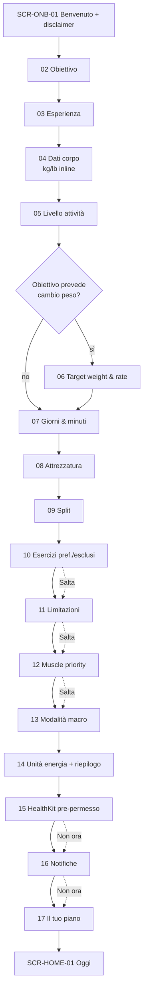
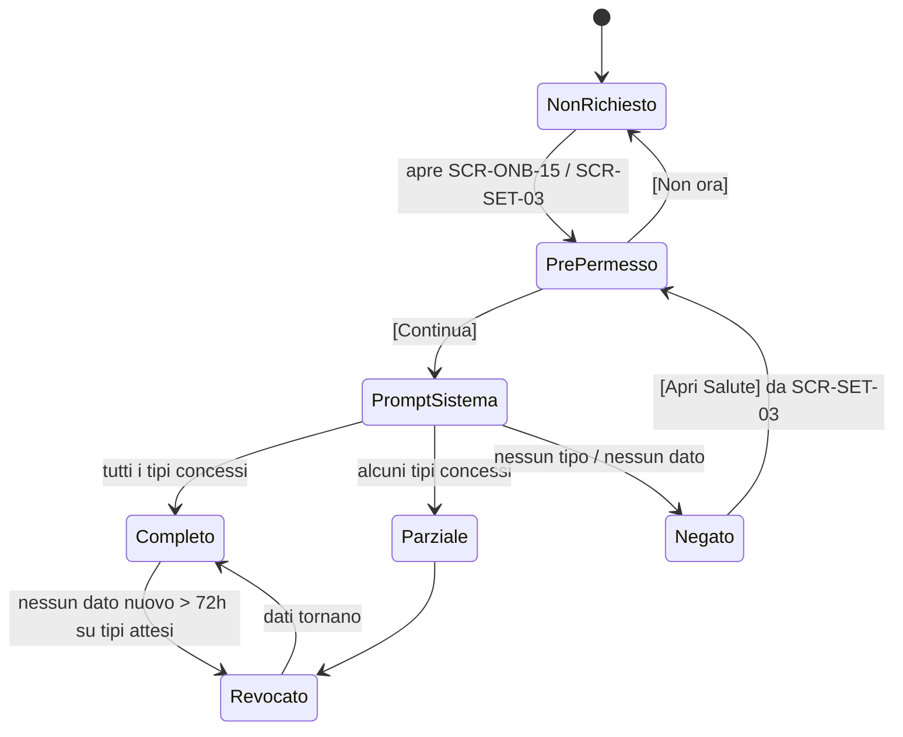
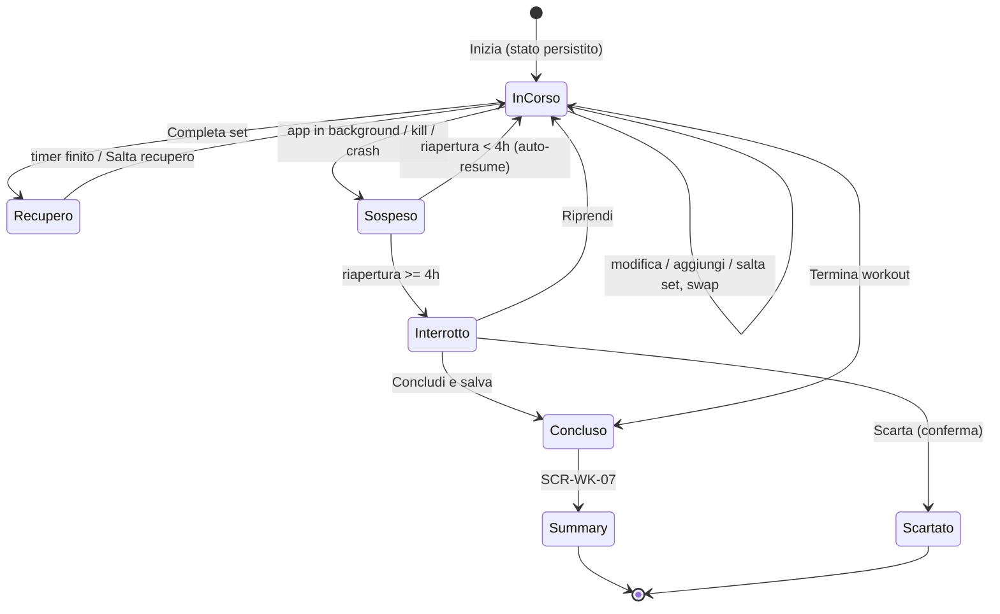
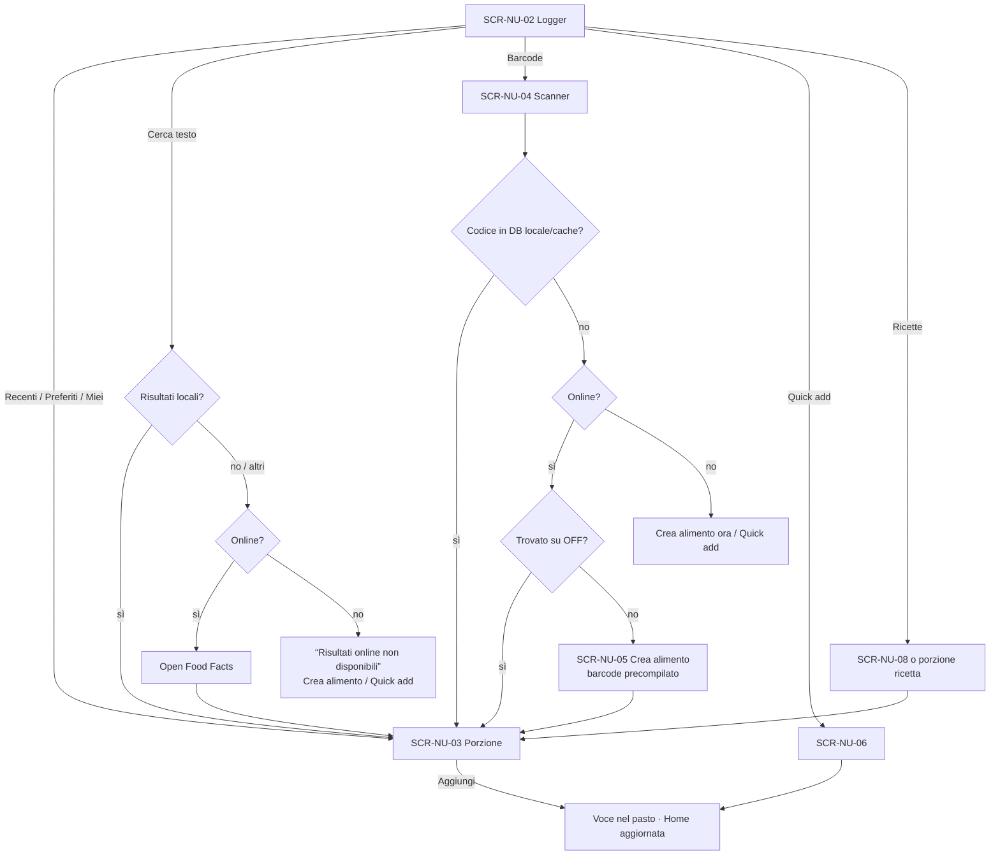
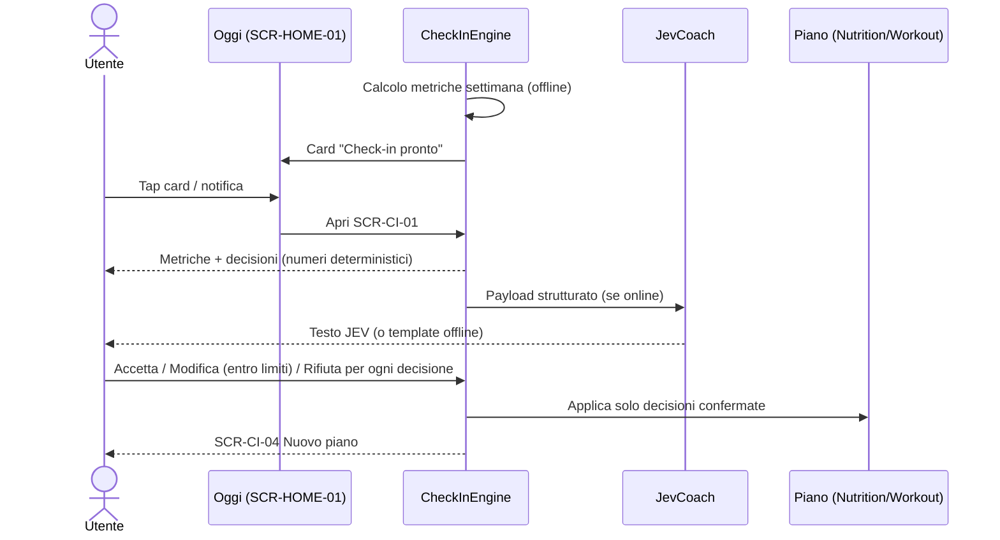
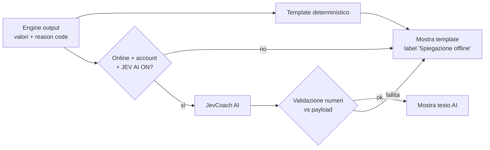

# JEV FIT — User Flows

> **Owner:** Agent 01 — Product & UX · **Fase:** 1 · **Stato:** Draft v1.0
> **Riferimenti:** requisiti `PS-*` in `PRODUCT_SPEC.md`, schermate `SCR-*` e componenti in `SCREEN_MAP.md`.

Convenzioni:
- Ogni flusso: **Trigger · Precondizioni · Schermate · Requisiti**, poi Happy path, Edge case, Stati vuoti, Offline, Errori.
- "→" = navigazione; `[Pulsante]` = azione UI; *corsivo* = copy indicativo.
- Il motore che produce un numero è indicato tra parentesi quando rilevante (es. *(NutritionEngine)*).
- Regola trasversale: **nessun flusso core attende la rete**. Le chiamate di rete sono sempre in background e non bloccano la navigazione.

## Indice
| ID | Flusso |
|---|---|
| UF-01 | Primo avvio & onboarding |
| UF-02 | Permessi HealthKit (concessi, parziali, negati, revocati) |
| UF-03 | Generazione programma & workout del giorno |
| UF-04 | Workout live completo |
| UF-05 | Summary post workout |
| UF-06 | Food logging (search, recenti, barcode, custom, quick add, ricetta, copia) |
| UF-07 | Pesata giornaliera |
| UF-08 | Weekly check-in |
| UF-09 | Interazione con JEV (card, sheet, chat, offline) |
| UF-10 | Cambio obiettivo in corso d'opera |
| UF-11 | Cambio unità |
| UF-12 | Creazione account & attivazione sync con dati locali |
| UF-13 | Reinstallazione / nuovo dispositivo |
| UF-14 | Notifiche |
| UF-15 | Segnalazione dolore & safety escalation |

---

## UF-01 — Primo avvio & onboarding

**Trigger:** primo avvio (nessun profilo locale). **Precondizioni:** nessuna; rete non necessaria.
**Schermate:** SCR-ONB-01 → SCR-ONB-17. **Requisiti:** PS-ON-01..11, PS-SAF-05.



### Happy path
1. SCR-ONB-01: logo, claim, 3 bullet (dati reali, coach JEV, funziona offline), disclaimer breve (*"JEV FIT non è un dispositivo medico…"*). `[Inizia]`. Link secondario `[Ho già un account]` → UF-13.
2. SCR-ONB-02 Obiettivo: 6 card (Forza, Ipertrofia, Mantenimento, Ricomposizione, Dimagrimento, Fitness generale) con una riga di effetto (*"Dimagrimento: deficit moderato, proteine alte, volume mantenuto"*).
3. SCR-ONB-03 Esperienza: Principiante (< 1 anno), Intermedio (1–4), Avanzato (> 4); sotto-testo su cosa cambia (rep range, progressione).
4. SCR-ONB-04 Dati corpo: peso (toggle kg/lb inline, default da locale), altezza (cm/ft-in), età, sesso biologico opzionale con `[Perché serve?]` → popover (PS-ON-04), body fat % opzionale.
5. SCR-ONB-05 Livello attività: 4 opzioni descritte con esempi concreti (passi/giorno indicativi, tipo di lavoro). Se HK verrà concesso, i passi saranno mostrati in Oggi; il loro uso come covariata dell'expenditure è previsto in V2 (nell'MVP l'expenditure si calibra su intake e trend peso).
6. SCR-ONB-06 (solo se obiettivo ≠ Mantenimento/Forza/Fitness generale, oppure se l'utente lo attiva): target weight + slider rate of change entro limiti (PS-ON-05) con data stimata *(NutritionEngine)*.
7. SCR-ONB-07: giorni/settimana (2–6) con giorni preferiti (chip L M M G V S D) e minuti per sessione (30/45/60/75/90).
8. SCR-ONB-08: preset attrezzatura → checklist espandibile.
9. SCR-ONB-09: split, default "Lascia decidere a JEV" con anteprima del suggerimento e motivo *(WorkoutEngine)*.
10. SCR-ONB-10: ricerca esercizi; tap = preferito, swipe/long-press = escluso. Opzionale.
11. SCR-ONB-11: limitazioni per area + intensità + nota. Opzionale.
12. SCR-ONB-12: fino a 3 gruppi prioritari sulla mini MuscleMap. Opzionale.
13. SCR-ONB-13: modalità macro AUTO (default) / ASSISTED / MANUAL; anteprima numeri *(NutritionEngine)*.
14. SCR-ONB-14: kcal/kJ, conferma unità peso/altezza, giorno del check-in (default lunedì), formato settimana.
15. SCR-ONB-15: HealthKit pre-permesso → UF-02.
16. SCR-ONB-16: notifiche pre-permesso con lista categorie e default (PS-NT); `[Attiva]` → prompt di sistema.
17. SCR-ONB-17 "Il tuo piano": stato di generazione (< 1 s, offline) → split, prossima sessione, target calorie allenamento/riposo, macro, TDEE con ConfidenceBadge, prima card JEV (template o AI). `[Inizia]` → SCR-HOME-01.

### Edge case
- **Kill app a metà:** riapertura sullo step salvato con valori precompilati.
- **Indietro:** sempre possibile; modificare l'obiettivo aggiorna i default degli step successivi non ancora toccati dall'utente (quelli toccati restano).
- **Età < 16 / > 80 o valori fuori range plausibile:** validazione inline (*"Controlla l'età inserita"*); per età < 16 l'app mostra che non è progettata per minori e non procede *(da confermare con CTO/legale)*.
- **Target weight incoerente con obiettivo** (es. Dimagrimento ma target > peso attuale): avviso inline e proposta di cambiare obiettivo.
- **Target weight sotto soglia BMI 18,5:** non selezionabile (PS-SAF-06), messaggio neutro.
- **Nessuna attrezzatura selezionata:** forzato preset "Corpo libero".
- **Esclusioni che svuotano un pattern** (es. tutte le spinte orizzontali): avviso "Nessun esercizio disponibile per Spinta orizzontale; il programma ne farà a meno".
- **Utente seleziona 6 giorni × 90 min da principiante:** suggerimento non bloccante a ridurre; accettato comunque.

### Stati vuoti
- Nessuno storico: Home mostra readiness "—" e JEV TODAY "Primo giorno: completa il workout per calibrare recupero e carichi."

### Offline
- Onboarding interamente offline. La card JEV finale usa template; `[Ho già un account]` offline → *"Serve la connessione per recuperare i tuoi dati. Puoi iniziare ora e collegare l'account dopo."*

### Errori
- Generazione programma fallita (bug engine): fallback a template di split predefinito per giorni/attrezzatura + log errore; messaggio *"Piano di base creato. JEV lo ottimizzerà dopo il primo workout."*

---

## UF-02 — Permessi HealthKit

**Trigger:** SCR-ONB-15 oppure Impostazioni → Salute (SCR-SET-03) oppure PermissionCallout in una card.
**Requisiti:** PS-HK-01..06, PS-RD-03.



Nota: iOS non rivela se un permesso di **lettura** è negato. Lo stato è dedotto dalla presenza di dati (es. nessun campione di body mass mai letto = "Nessun dato").

### Happy path (concessi)
1. SCR-ONB-15: lista tipi con riga "→ a cosa serve" (Peso → trend; Body fat → BMR più preciso; Passi/Energia attiva → livello attività; Workout → recupero e carico; Sonno, FC a riposo, HRV, FC → JEV READINESS). Toggle scritture (workout, peso, nutrizione) default OFF.
2. `[Continua]` → prompt HealthKit di sistema → l'utente concede.
3. Import iniziale in background (ultimi 90 giorni) *(HealthKitService)*; la UI non attende. Toast discreto *"Importati 47 pesate e 23 workout da Salute"*.
4. Pesate importate alimentano subito il trend; workout non di forza entrano nel carico (PS-RC-04).

### Parziali
- Feature con dato mancante mostrano PermissionCallout nel rispettivo dettaglio (non in Home): es. Readiness detail *"Sonno non disponibile. Inserisci come hai dormito o abilita Sonno in Salute."*
- Readiness passa a "Stima parziale".

### Negati / Non ora
- Nessun popup ripetuto. Tutti gli input manuali attivi (peso manuale, check soggettivo, workout esterni inseribili manualmente come "Attività" con durata e intensità).
- SCR-SET-03 mostra stato "Non collegato" + `[Collega Salute]`.

### Revocati dopo
1. HealthKitService rileva assenza di nuovi campioni per tipi che prima arrivavano (> 72 h per peso se l'utente pesava via bilancia smart; > 48 h per sonno).
2. Stato in SCR-SET-03: "Nessun dato recente da Salute (Sonno, Peso)". Readiness → "Stima parziale".
3. Nessun popup; JEV può citarlo una volta nella card: *"Da 3 giorni non ricevo dati sul sonno da Salute. Readiness stimata senza sonno."*
4. I dati già importati restano.

### Edge case
- **Doppia fonte peso** (bilancia smart in Salute + inserimento manuale): vedi UF-07 deduplica.
- **Workout di forza registrato da un'altra app in Salute:** importato come "Workout esterno" (durata, energia), contribuisce al carico generico, non crea set; JEV suggerisce di loggarlo in JEV FIT per avere progressione.
- **Le nostre scritture:** mai re-importate (filtro per source).

### Errori
- HealthKit non disponibile (dispositivo/restrizioni MDM): sezione nascosta con nota in Impostazioni.

---

## UF-03 — Generazione programma & workout del giorno

**Trigger:** fine onboarding; Allenamento → `[Nuovo programma]`; check-in con decisione CHANGE EXERCISE / DELOAD.
**Schermate:** SCR-WK-01, 02, 03, 12, 13. **Requisiti:** PS-PG-01..09.

### Happy path — workout del giorno
1. SCR-HOME-01 card Workout Today: nome sessione ("Upper A"), durata stimata, n. esercizi, gruppi target con RecoveryChip, eventuale nota readiness. `[Inizia]` / tap card → SCR-WK-03.
2. SCR-WK-03 Anteprima: lista esercizi con target (es. "Panca piana · 3 × 6–8 · 85 kg · RIR 2") e badge esito overload (↑ carico, ↑ reps, =, ↓, deload). Azioni: riordina, swap, rimuovi, aggiungi esercizio, `[Versione ridotta]` se readiness bassa.
3. `[Inizia workout]` → SCR-WK-04 (UF-04).

### Happy path — generazione/modifica programma
1. SCR-WK-01 → `[Programma]` → SCR-WK-02 (settimana tipo, mesociclo, deload previsto) → `[Modifica]` o `[Nuovo programma]` → SCR-WK-12.
2. SCR-WK-12: input precompilati dal profilo (giorni, minuti, split, attrezzatura, priorità). `[Genera]` → anteprima programma con motivazione split *(WorkoutEngine reason codes)*.
3. Editor: per sessione, riordina/sostituisci esercizi, modifica set/rep range. Valori fuori range consigliato → avviso inline non bloccante.
4. `[Salva programma]`: il programma precedente viene archiviato (storico conservato); la rotazione riparte dalla sessione 1, salvo `[Mantieni posizione]`.

### Workout rapido
1. SCR-WK-01 → `[Workout rapido]` → SCR-WK-13: tempo (slider 20–90 min), focus (Auto / scelta gruppi), attrezzatura del momento (preset del profilo modificabile solo per oggi).
2. `[Genera]` → SCR-WK-03 con sessione one-off (non altera la rotazione del programma).

### Edge case
- **Giorni saltati:** la prossima sessione resta la stessa (rotazione). Dopo ≥ 10 giorni senza allenamento, JEV propone *"Ripresa: carichi −10% nella prima sessione"* (proposta, PS-PO-02 Regressione).
- **Due sessioni nello stesso giorno:** consentito; la seconda mostra avviso recovery se i gruppi coincidono.
- **Sessione del programma con gruppi a recovery < 40%:** card mostra RecoveryChip Ember e opzione `[Scambia con sessione successiva]`.
- **Readiness < 40:** card propone `[Versione ridotta]` (PS-PG-08), mai automatica.
- **Attrezzatura cambiata in profilo:** esercizi non più eseguibili sono marcati e sostituiti con proposta (conferma utente).

### Stati vuoti
- Nessun programma (utente ha cancellato): SCR-WK-01 mostra EmptyStateView con `[Genera programma]` e `[Workout libero]`.

### Offline
- Generazione e modifica interamente offline.

### Errori
- Nessun esercizio compatibile per una sessione (esclusioni troppo restrittive): sessione generata con gli esercizi disponibili + avviso con link a SCR-SET-07.

---

## UF-04 — Workout live completo

**Trigger:** `[Inizia workout]` da SCR-WK-03, Home, o notifica. **Schermate:** SCR-WK-04 (full-screen), SCR-WK-05 (swap), SCR-WK-06 (opzioni set/dolore), SCR-WK-08 (aggiungi esercizio), SCR-WK-15 (interrotto).
**Requisiti:** PS-WK-01..13, PS-PO-06.



### Happy path
1. SCR-WK-04 si apre sul primo esercizio. In alto: barra progresso workout (esercizi), tempo trascorso, `[JEV]`, `[…]` (opzioni workout).
2. Blocco esercizio: nome, target (es. "3 × 6–8 @ RIR 2"), **Precedente**: "80 × 8, 80 × 8, 80 × 7" (ultima sessione).
3. Lista set (SetRow): ogni riga precompilata con target weight/reps *(WorkoutEngine)*; il set corrente è espanso con BigStepper peso (± incremento attrezzatura) e reps (± 1), RIRPicker.
4. `[Completa set]` (pulsante 56+ pt, zona pollice): salva immediatamente, haptic success, avvia RestTimerBar (es. 2:30).
5. Durante il recupero: timer grande, `[−15s] [+15s] [Salta]`; il set successivo è già precompilato e modificabile.
6. **Regola primo set (PS-PO-06):** se il primo working set ha RIR reale ≤ target − 2 (es. RIR 0 vs 2), banner Ion: *"Primo set più duro del previsto. Prossimo set: 82,5 kg."* `[Applica]` / `[Ignora]`.
7. Completati i set → transizione automatica all'esercizio successivo (swipe orizzontale o `[Prossimo]`).
8. `[Termina workout]` (sempre accessibile da `[…]`; in evidenza all'ultimo set) → conferma se ci sono set non completati (*"3 set non completati verranno segnati come saltati"*) → SCR-WK-07.

### Swap esercizio
1. Tap nome esercizio o `[…]` → `[Sostituisci]` → SCR-WK-05 sheet.
2. Lista alternative ordinate per ExerciseScore con tag motivo e target calcolato. Filtro "Solo attrezzatura disponibile qui".
3. Selezione → set completati restano sull'originale; i rimanenti passano al nuovo con target ricalcolato. Toggle `[Sostituisci anche nel programma]` (default OFF).

### Aggiungi / salta set e esercizi
- `[+ Set]` sotto la lista: copia valori dell'ultimo set. Tipo set dal menu SetTypeBadge (Warm-up, Working, Top, Back-off, Drop, Failure, AMRAP).
- Swipe su SetRow: `[Salta]`, `[Elimina]` (solo set non completati) ; long-press → SCR-WK-06 (tipo set, nota, dolore, RPE).
- `[…]` → `[Aggiungi esercizio]` → SCR-WK-08 in modalità selezione; `[Salta esercizio]`; `[Riordina]`.

### App chiusa a metà / crash
1. Ogni azione è persistita (PS-WK-09). Al relaunch, se esiste una sessione "InCorso" con ultimo input < 4 h: Live mode si riapre direttamente; il timer di recupero è ricalcolato dal timestamp di fine (se già scaduto → mostra "Recupero terminato 1:12 fa").
2. Se l'utente apre l'app su un altro tab: ResumeWorkoutBanner persistente sopra la tab bar con `[Riprendi]`.

### Workout abbandonato
1. Riapertura con ultimo input ≥ 4 h → SCR-WK-15: *"Workout di ieri interrotto alle 19:42 (12 set completati)"*. `[Concludi e salva]` (default) / `[Riprendi]` / `[Scarta]`.
2. `[Concludi e salva]`: end time = timestamp ultimo set; vai a Summary.
3. `[Scarta]` richiede conferma distruttiva; i dati vengono eliminati (anche da sync).

### Set modificato dopo
- Durante il workout: tap su un set completato → modifica inline; volume e suggerimenti successivi ricalcolati.
- Dopo il workout: SCR-WK-10 → SCR-WK-11 → `[Modifica]` → set editabili; al salvataggio *(WorkoutEngine, RecoveryEngine)* ricalcolano PR, e1RM, recovery; se cambia un PR, toast *"PR aggiornato"*.

### Edge case
- **Peso target non realizzabile** (es. manubri 32 kg non disponibili): BigStepper salta ai valori disponibili dell'attrezzatura dichiarata.
- **Reps molto sopra il target** (es. 15 su 6–8): conferma soft *"15 reps? Il prossimo carico verrà alzato."*
- **Set di riscaldamento suggeriti:** opzionali, generati per il primo esercizio composto (toggle in impostazioni).
- **Due esercizi uguali nella sessione:** consentito, distinti per indice.
- **Chiamata telefonica / Siri:** timer continua (basato su timestamp).
- **Notifica fine recupero con device bloccato:** suono/vibrazione secondo impostazioni di sistema.

### Stati vuoti
- Workout libero senza esercizi: EmptyStateView *"Aggiungi il primo esercizio"* `[Aggiungi]`.
- Esercizio senza storico: "Precedente: —" e target *"Primo set esplorativo: scegli un carico da RIR 3"*.

### Offline
- Totalmente offline. Pulsante JEV apre lo sheet con spiegazione template del target corrente.

### Errori
- Scrittura locale fallita (disco pieno): banner non bloccante *"Spazio insufficiente: i set sono in memoria, libera spazio per salvarli"*; retry automatico a ogni azione.

---

## UF-05 — Summary post workout

**Trigger:** `[Termina workout]` o `[Concludi e salva]`. **Schermata:** SCR-WK-07. **Requisiti:** PS-WK-20..22.

### Happy path
1. Header: nome sessione, data, durata.
2. Hero: Total Volume con DeltaBadge vs sessione equivalente precedente.
3. PR: lista PRBadge (es. "Panca e1RM 104,2 kg · +2,1"). Se nessun PR → sezione nascosta (no "0 PR").
4. Muscles Trained: mini MuscleMap + hard sets per gruppo.
5. Performance vs Previous: per esercizio, delta % (tonnage o e1RM) con freccia.
6. Estimated Recovery: gruppi principali con ore stimate a ≥ 90% *(RecoveryEngine)*.
7. Card JEV (Ion Rail): commento + prossima azione, `[Perché?]` → WDC.
8. Rating fatica 1–5 (opzionale) + nota.
9. `[Salva]` → chiude il full-screen cover, torna al tab di origine; Home aggiorna Recovery e Readiness. Se toggle HK scrittura ON → workout scritto in Salute.

### Edge case
- **Workout con < 3 set completati:** chiede *"Salvare un workout molto breve?"* `[Salva]` / `[Scarta]`.
- **Sessione ridotta** (PS-PG-08): badge "Ridotta"; JEV non la considera regressione.
- **Tutti i set saltati:** summary sostituito da conferma di scarto.
- **Utente chiude con swipe-down:** non possibile (full-screen); il summary è già salvato al momento in cui appare, `[Salva]` conferma solo rating/nota.

### Offline
- Summary completo offline; commento JEV template, arricchito con AI alla successiva apertura online solo se il summary è ancora visibile (poi resta nello storico).

### Errori
- Scrittura HealthKit fallita: nessun blocco; stato in SCR-SET-03 "Ultima scrittura non riuscita" con retry.

---

## UF-06 — Food logging

**Trigger:** `[+]` in SCR-NU-01, `[+]` di un pasto, notifica pasto, shortcut barcode. **Schermate:** SCR-NU-02..09.
**Requisiti:** PS-FL-01..13.



### Happy path — Recenti
1. SCR-NU-01 → `[+]` su "Pranzo" → SCR-NU-02 (sheet, large detent) con segmento Recenti attivo, pasto "Pranzo" preselezionato.
2. Ogni FoodRow mostra nome, ultima porzione usata, kcal. Tap su `[+]` della riga = aggiunta immediata con ultima porzione (1 tap). Tap sulla riga = SCR-NU-03.
3. Toast *"Riso basmati 80 g aggiunto · Annulla"*; il logger resta aperto per aggiunte multiple; contatore in basso "3 alimenti · 642 kcal" `[Fine]`.

### Search
1. Campo ricerca sempre in alto; risultati locali/recenti/custom istantanei; sezione "Open Food Facts" sotto, con loader di sezione.
2. SCR-NU-03: porzione (PortionPicker: g/ml, porzione prodotto, unità naturali, moltiplicatori), anteprima kcal e MacroBar di impatto sul giorno ("Dopo: 1.240 kcal rimaste · Proteine 118/165 g"). `[Aggiungi a Pranzo]`.

### Barcode
1. `[Barcode]` → SCR-NU-04 full-screen camera con ScannerOverlay; torcia; inserimento manuale codice.
2. Trovato → vibrazione → SCR-NU-03.
3. Non trovato → SCR-NU-05 con barcode precompilato; suggerimento *"Copia i valori dall'etichetta per 100 g"*. Salvataggio → SCR-NU-03 → aggiunta. Alla scansione successiva viene trovato localmente.
4. Permesso fotocamera negato → schermata con spiegazione + `[Apri Impostazioni]` + `[Inserisci codice]`.

### Quick add
- SCR-NU-06: kcal, P, C, F (tutti opzionali ma almeno uno), nome facoltativo ("Cena fuori"), pasto. Se kcal vuote → calcolate 4/4/9; se kcal < somma macro×fattori → avviso soft.

### Ricetta
1. Segmento Ricette → tap ricetta → SCR-NU-03 in modalità ricetta (porzioni o grammi) → `[Aggiungi]`.
2. `[Nuova ricetta]` → SCR-NU-08: nome, ingredienti (stessa ricerca del logger), porzioni totali o peso finale cotto, anteprima per porzione → `[Salva]`.

### Copia ieri / copia pasto
1. SCR-NU-01 → menu pasto `[…]` → `[Copia da…]` → SCR-NU-09: data (default ieri), pasto sorgente, anteprima voci con checkbox e totale kcal → `[Copia in Cena]`.
2. Giorno vuoto: CTA in EmptyStateView `[Copia ieri]` (giorno intero, con anteprima).

### Edge case
- **Log tra 00:00 e 04:00:** toggle *"Aggiungi a ieri"* visibile in SCR-NU-03 (PS-FL-12).
- **Viaggio con fuso orario:** la voce appartiene al giorno locale al momento del log; giorni precedenti non vengono riassegnati.
- **Modifica/eliminazione voce:** swipe su FoodRow in SCR-NU-01 → `[Elimina]` con Annulla; tap → SCR-NU-03 in modalità modifica.
- **Alimento OFF con dati incoerenti** (kcal ≠ macro): badge "Dati incoerenti" + `[Salva come personale]` per correggere.
- **Porzione 0 o > 5 kg:** validazione.
- **Ricetta modificata:** i log passati restano invariati (snapshot).
- **Log su un giorno passato:** possibile da DayNavigator; se il giorno era "Incompleto", JEV chiede se segnarlo completo.

### Stati vuoti
- Recenti vuoti (nuovo utente): suggerimenti di ricerca e `[Scansiona barcode]`.
- Preferiti vuoti: *"Tocca la stella su un alimento per averlo qui."*
- Ricette vuote: `[Crea la prima ricetta]`.

### Offline
- Recenti, preferiti, miei, ricette, DB locale, barcode in cache: pienamente funzionanti. Sezione OFF sostituita da nota. Nessun spinner bloccante.

### Errori
- Timeout OFF (> 5 s): sezione online mostra `[Riprova]`, i risultati locali restano usabili.
- Rate limit OFF: stessa gestione, nessun popup.

---

## UF-07 — Pesata giornaliera

**Trigger:** notifica mattutina, card "Pesata di oggi" in Home, `[+]` in Progressi → Peso, Corpo, import HK.
**Schermate:** SCR-WT-01 (sheet), SCR-PR-02 (metric=weight). **Requisiti:** PS-WT-01..07.

### Happy path manuale
1. Notifica 07:30 → deep link `jevfit://weight/new` → SCR-WT-01 (medium detent).
2. Valore precompilato con l'ultima pesata; BigStepper ±0,1 kg o tastiera numerica; data/ora (default ora); body fat % opzionale.
3. `[Salva]` → aggiornamento trend *(NutritionEngine/WeightTrend)*; toast *"Trend 78,6 kg · −0,4 kg/sett."*; la card pesata in Home scompare.

### Happy path HealthKit
1. Bilancia smart scrive in Salute → HealthKitService importa al foreground/background delivery.
2. Pesata visibile con SourceTag SALUTE; nessuna notifica di promemoria se la pesata esiste già prima delle 07:30.

### Duplicati e multipli
- Stesso valore (±0,05 kg) entro 10 min da manuale + Salute → una sola pesata (manuale prevale), PS-WT-03.
- Valori diversi nello stesso giorno → entrambi salvati; il valore giornaliero è la prima pesata (o media, da impostazioni). In SCR-PR-02 il giorno mostra "2 pesate".
- Pesata scritta da noi su Salute → mai re-importata.

### Edge case
- **Outlier/typo** (> 3% dal trend): conferma soft (PS-WT-06). Se confermato, il filtro robusto ne limita l'effetto.
- **Pesata retroattiva** (giorno passato): consentita; trend ricalcolato.
- **Eliminazione pesata HK:** eliminabile in app solo se manuale; per quelle di Salute, `[Nascondi]` (esclusa dai calcoli).
- **Cambio fuso orario:** giorno = data locale di misurazione.

### Stati vuoti
- Nessuna pesata: Weight Trend in Home mostra *"Pesati per iniziare il trend"* `[Aggiungi]`.
- 1–2 pesate: valore + "Trend in calcolo (ancora 2 pesate)".

### Offline
- Totalmente offline.

### Errori
- Valore non numerico/fuori range (20–350 kg): validazione inline.

---

## UF-08 — Weekly check-in

**Trigger:** giorno check-in alle 05:00 → card in Home + notifica. **Schermate:** SCR-CI-01 → 02 → (03) → 04.
**Requisiti:** PS-CI-01..08, PS-SAF-03.



### Happy path
1. Card Home *"Check-in settimana 14–20 ott pronto"* → SCR-CI-01 (full-screen cover, pagina 1/3).
2. **Panoramica:** griglia StatTile: Weight Trend (−0,42 kg/sett., target −0,40), Expenditure (2.740 kcal · 91%), Average Calories (2.236), Protein adherence (6/7 giorni ≥ target), Workout adherence (4/4), Strength trend (+1,8%), Training volume (64 hard sets, −2%), Recovery medio (78), Readiness media (71), Goal progress (62%). Card JEV sintetica. `[Continua]`.
3. **Decisioni (SCR-CI-02):** una DecisionCard per decisione. Esempio:
   - DECREASE CALORIES: "Calorie medie 2.250 → 2.150 kcal/die" · WHY: *"Trend −0,25 kg/sett. vs target −0,40"* · DATA: pesate 6/7, giorni loggati 7/7, periodo 21 gg · CONFIDENCE 88%. `[Accetta] [Modifica] [Rifiuta]`.
   - INCREASE TRAINING LOAD: "Dorsali 10 → 12 set/sett." con dati recovery.
4. `[Modifica]` → SCR-CI-03 sheet con BigStepper limitato (PS-CI-05); ai limiti: *"Massimo −250 kcal per check-in"*.
5. `[Accetta tutto]` disponibile in fondo; con decisioni già toccate applica solo le rimanenti.
6. **Conferma (SCR-CI-04):** prima → dopo per calorie (allenamento/riposo), macro, cambi di volume/esercizi; data di efficacia (da oggi). `[Conferma piano]` → Home aggiornata, check-in archiviato nello storico JEV.

### Rifiuta
- Una decisione rifiutata resta nello storico come "Rifiutata"; il CheckInEngine non la ripropone identica alla settimana successiva se i dati non cambiano significativamente (evita insistenza).

### Edge case
- **Solo NO ACTION / KEEP:** pagina decisioni mostra una sola card *"Piano confermato: tutto in linea"* + `[Conferma]`.
- **Dati insufficienti:** check-in parziale (PS-CI-06) con spiegazione e cosa serve la prossima settimana.
- **Decisione in conflitto con safety** (trigger attivo): le decisioni di riduzione calorie sono sostituite da NO ACTION + SafetyNotice.
- **Macro mode MANUAL:** le decisioni nutrizionali sono "Suggerimenti" con `[Applica]` invece di Accetta; nessuna applicazione automatica.
- **Rinvio:** `[Più tardi]` → 24/48 h. Dopo 3 giorni → "Saltato".
- **Check-in aperto due volte:** riprende dalle scelte già fatte (stato persistito).
- **Cambio obiettivo durante la settimana:** check-in calcolato solo sui giorni della nuova fase se ≥ 4, altrimenti parziale.

### Offline
- Numeri e decisioni completamente offline; testo JEV template. Il testo AI arriva in seguito, senza cambiare numeri o scelte.

### Errori
- Applicazione fallita di una decisione (validazione engine): quella decisione resta "Non applicata" con motivo; le altre vengono applicate.

---

## UF-09 — Interazione con JEV

**Trigger:** card JEV TODAY, pulsante JEV in navigation bar, `[Perché?]` su raccomandazioni. **Schermate:** SCR-HOME-01 (JevTodayCard), SCR-JEV-01..06.
**Requisiti:** PS-JEV-01..09.



### Card JEV TODAY
1. In Home, sotto Readiness: 2–3 frasi, Ion Rail, ConfidenceBadge, `[Dettagli]`.
2. Contenuto in priorità: safety > workout di oggi > nutrizione di oggi > trend settimanale.
3. Tap → SCR-JEV-01 con "Consiglio di oggi" espanso.

### JEV sheet
1. Pulsante JEV (navigation bar, ogni tab) → SCR-JEV-01 (sheet, medium/large detent) con contesto della tab di origine.
2. Sezioni: Consiglio di oggi; Raccomandazioni attive (RecommendationRow con azione e `[Perché?]` → SCR-JEV-03 WDC completo); Chiedi a JEV (campo + 3 domande suggerite contestuali); Storico check-in (→ SCR-JEV-04).
3. Raccomandazione azionabile → `[Applica]` → validazione engine → conferma *"Applicato a Upper A di giovedì"*; `[Ignora]` la archivia.

### Chat
1. Tap campo o domanda suggerita → SCR-JEV-02 (push nello sheet). Messaggi JEV con Ion Rail; i numeri nei messaggi sono tappabili → mostrano metrica e fonte.
2. JEV può proporre azioni come card azionabili dentro la chat (stessa validazione).
3. Domande fuori ambito o mediche → risposta safety (PS-SAF).

### Offline / senza account
- Card e raccomandazioni: template (*"Spiegazione offline"*).
- Chat: campo disabilitato con motivo; senza account → `[Accedi con Apple]` (UF-12). Domande suggerite con risposta deterministica restano attive (es. "Perché questo carico?").
- Messaggio inviato e rete persa durante l'invio: bolla con `[Riprova]`, nessun messaggio perso.

### Edge case
- **JEV AI OFF da Privacy:** come offline, senza CTA insistenti.
- **Nessun dato (giorno 1):** consiglio di oggi = istruzioni di calibrazione.
- **Numero non validato:** fallback silenzioso a template (log interno).

### Errori
- Timeout AI > 8 s: mostra template, sostituito dal testo AI solo se arriva prima che l'utente chiuda lo sheet (senza salto di layout: crossfade).

---

## UF-10 — Cambio obiettivo in corso d'opera

**Trigger:** Profilo → Impostazioni → Obiettivo (SCR-SET-06), oppure suggerimento JEV ("Hai raggiunto il target weight"). **Schermate:** SCR-SET-06 → SCR-SET-13.

### Happy path
1. SCR-SET-06: obiettivo attuale + data inizio fase. `[Cambia obiettivo]` → stessi step dell'onboarding per obiettivo, target weight, rate.
2. SCR-SET-13 Anteprima: diff prima → dopo (calorie, macro, rep range, volume, split se cambia) con motivazioni *(NutritionEngine, WorkoutEngine)*.
3. Scelta `[Applica da oggi]` (default) o `[Applica al prossimo check-in]`.
4. Conferma → nuova **fase** (marker nei grafici di Progressi); Goal progress riparte; storico intatto.

### Edge case
- **Raggiunto target weight:** JEV propone Mantenimento con transizione calorica graduale (al massimo +150 kcal/die a settimana *(proposta)*).
- **Cambio frequente** (> 1 volta in 14 giorni): avviso *"Cambi ravvicinati riducono l'affidabilità delle stime"*; consentito.
- **Da Dimagrimento a Forza con split invariato:** programma mantiene esercizi, cambia rep range e progressione.
- **Workout in corso:** cambio consentito, applicato dalla sessione successiva.

### Offline
- Interamente offline.

---

## UF-11 — Cambio unità

**Trigger:** SCR-SET-02. **Requisiti:** PS-ST-01..02, PS-NU-09.

### Happy path
1. SCR-SET-02: Peso (kg/lb), Energia (kcal/kJ), Altezza (cm/ft-in) indipendenti.
2. Cambio kg → lb: anteprima *"Panca: prossimo target 85 kg → 187,5 lb (arrotondato a 185 lb)"*; `[Conferma]`.
3. Tutta la UI si aggiorna immediatamente; storico convertito per la visualizzazione (dato originale conservato); target di carico arrotondati agli incrementi della nuova unità; incrementi manubri riconvertiti (l'utente può ridefinire il range manubri in lb).

### Edge case
- **Cambio durante workout live:** consentito solo da Impostazioni a fine workout; durante il live l'opzione è disabilitata con nota.
- **Alimenti in once/fl oz:** porzioni mostrate nell'unità del sistema scelto se disponibili, altrimenti grammi.
- **kJ:** Calories Remaining, target e grafici in kJ; l'arrotondamento è a 10 kJ.

---

## UF-12 — Creazione account & attivazione sync con dati locali

**Trigger:** SCR-SET-05 `[Accedi con Apple]`, CTA chat JEV, CTA "Proteggi i tuoi dati" in Impostazioni. **Schermate:** SCR-AC-01, SCR-AC-02, SCR-SET-05.
**Requisiti:** PS-AC-01..06.

```mermaid
flowchart TD
  A[Sign in with Apple] --> B{Account esiste<br/>con dati cloud?}
  B -- no --> C[Upload completo dati locali] --> OK[Sync attiva]
  B -- sì --> D{Dati locali presenti?}
  D -- no --> E[Download dati cloud] --> OK
  D -- sì --> F[SCR-AC-02 Unisci dati]
  F -->|Unisci (default)| G[Merge per ID<br/>dedupe + last-write-wins per record] --> OK
  F -->|Usa solo cloud| H[Conferma distruttiva<br/>dati locali eliminati] --> E
  F -->|Annulla| X[Logout, nessun cambiamento]
```

### Happy path (nuovo account, dati locali)
1. SCR-AC-01: cosa abilita l'account (sync, JEV AI chat, ripristino), cosa non cambia (funziona tutto offline). `[Accedi con Apple]`.
2. Autenticazione → upload in background con progress in SCR-SET-05 (*"Sincronizzazione: 1.240 / 3.100 elementi"*). L'app resta utilizzabile.
3. Completato: "Ultima sync: ora".

### Account esistente + dati locali
1. SCR-AC-02: riepilogo (*"Su questo iPhone: 34 workout, 210 giorni di nutrizione. Nel cloud: 120 workout, 400 giorni."*).
2. `[Unisci]` (default, consigliato): merge per ID; record identici → uno; workout duplicati su entrambi (stesso ID) → uno; set mai eliminati dal merge.
3. Programma attivo: se diverso, chiede quale mantenere (l'altro va in archivio).
4. Profilo/obiettivo: vince il più recente con conferma.

### Edge case
- **Sync interrotta (rete persa):** ripresa automatica; nessun duplicato grazie a ID locali stabili.
- **Logout:** chiede se mantenere i dati sul dispositivo (default sì) o rimuoverli.
- **Eliminazione account:** SCR-SET-10 → conferma con testo esplicito → dati cloud eliminati, dati locali mantenuti o rimossi a scelta.
- **Apple ID con email nascosta:** nessun impatto.

### Offline
- Login richiede rete: CTA disabilitata con *"Serve la connessione"*. Modifiche offline accodate e sincronizzate al ritorno.

### Errori
- Errore persistente > 24 h: badge su avatar profilo + riga in SCR-SET-05 con `[Riprova]` e codice errore copiabile.

---

## UF-13 — Reinstallazione / nuovo dispositivo

**Trigger:** primo avvio su app reinstallata o nuovo iPhone.

### Con account
1. SCR-ONB-01 → `[Ho già un account]` → Sign in with Apple → download dati → Home (nessun onboarding).
2. HealthKit: permessi da richiedere di nuovo sul nuovo dispositivo → UF-02 (pre-permesso con *"Ricollega Salute"*).
3. Notifiche: permesso da richiedere di nuovo; preferenze ripristinate dal cloud.
4. Workout in corso su altro dispositivo: mostrato come "In corso su un altro iPhone" con `[Concludi qui]`.

### Senza account
1. Nuovo onboarding (dati persi, salvo ripristino da backup del dispositivo, PS-AC-06).
2. Se HealthKit concesso: import di pesate e workout esterni degli ultimi 90 giorni per ricostruire trend e carico; i set non sono recuperabili da Salute.
3. Import da export JSON di JEV FIT (`[Importa backup]` in SCR-SET-10) se l'utente lo aveva salvato.

### Edge case
- **Ripristino da backup iCloud del dispositivo:** dati locali presenti → nessun onboarding; permessi HK da verificare.
- **Due dispositivi attivi contemporaneamente:** supportato; un solo workout "InCorso" per account (il secondo mostra avviso).

---

## UF-14 — Notifiche

**Trigger:** onboarding SCR-ONB-16, SCR-SET-04. **Requisiti:** PS-NT-01..08.

| Notifica | Quando | Soppressa se | Deep link |
|---|---|---|---|
| Pesata mattutina | orario scelto (07:30) | pesata già presente oggi | `jevfit://weight/new` |
| Log pasti | orari per pasto (OFF default) | pasto già loggato | `jevfit://nutrition/log?meal=<id>` |
| Fine recupero | fine timer, app in background | app in foreground | `jevfit://workout/live` |
| Promemoria workout | giorni preferiti, orario scelto | workout già fatto/in corso oggi | `jevfit://workout/today` |
| Check-in pronto | giorno check-in 05:00 → consegna a orario attivo (08:00) | check-in già completato | `jevfit://checkin/current` |

### Happy path
1. SCR-ONB-16 spiega categorie e default → `[Attiva]` → prompt di sistema.
2. Le notifiche sono pianificate localmente; tap → deep link.

### Edge case
- **Permesso negato:** SCR-SET-04 mostra stato + `[Apri Impostazioni]`; nessun reminder in-app insistente.
- **Quiet hours:** notifiche spostate alla fine (eccetto fine recupero).
- **Max 2 non-timer/giorno:** priorità Check-in > Workout > Pesata > Pasti.
- **Ignorata 14 volte:** proposta in-app di disattivazione (PS-NT-07).
- **Fuso orario cambiato:** ripianificazione all'orario locale.

---

## UF-15 — Segnalazione dolore & safety escalation

**Trigger:** nota dolore in workout (SCR-WK-06), limitazione in profilo, messaggio chat, trigger nutrizionali/peso.
**Schermate:** SCR-WK-06, SCR-JEV-06 (SafetyNotice), SCR-SET-08. **Requisiti:** PS-WK-08, PS-SAF-01..07.

### Happy path (dolore lieve)
1. In live mode, long-press su set → `[Segnala dolore]` → SCR-WK-06: area (preselezionata dai muscoli dell'esercizio), intensità Lieve/Moderato/Forte, nota.
2. Lieve: salvato; il WorkoutEngine riduce l'ExerciseScore per quell'area nelle prossime 2 settimane; nessun popup.

### Dolore forte
1. Banner immediato: *"Dolore forte segnalato. Ti consiglio di interrompere questo esercizio."* `[Sostituisci esercizio]` `[Salta esercizio]` `[Continua comunque]`.
2. Al summary: SafetyNotice *"Se il dolore persiste, rivolgiti a un medico o fisioterapista."*

### Dolore ricorrente
1. ≥ 2 segnalazioni sulla stessa area in 14 giorni → SafetyNotice in Home (24 h) + area marcata nel Body screen.
2. Nessun aumento di carico automatico sugli esercizi che coinvolgono l'area (PS-SAF-03) finché l'utente non conferma `[Ho letto]`.
3. `[Aggiungi come limitazione]` → SCR-SET-08 precompilato.

### Trigger nutrizione/peso
- Perdita rapida o intake troppo basso (PS-SAF-02): SafetyNotice + check-in non propone ulteriori riduzioni; JEV: *"Il tuo trend indica −1,7% a settimana da 2 settimane. È più rapido del limite che consideriamo sicuro. Valuta con un medico o un nutrizionista; non ridurrò ulteriormente le calorie."*

### Chat
- Sintomi acuti: JEV interrompe il coaching, indica 112 / medico, non fornisce ipotesi diagnostiche.

### Offline
- Tutti i trigger e i testi safety sono deterministici e funzionano offline.
